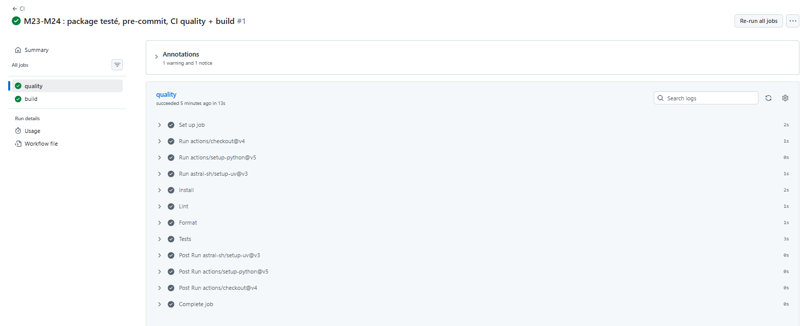
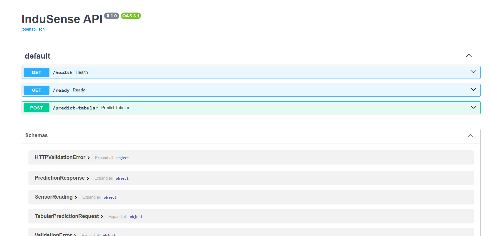

# Journal de bord — Sprint 3 CISIA · InduSense 4.0

> **Livrable certifiant** : prouve, module par module, *ce que j'ai fait · ma preuve · la compétence visée · une difficulté*. Sert d'antisèche pour l'oral (C1→C9), à raconter en **contexte → problème → choix → preuve → limite**.

**Règles de remplissage**
- **Une preuve** = une commande qui répond, un résultat chiffré, un fichier produit ou une capture, rangée dans `preuves/` sous la forme `<module>_<étape>_<quoi>.<ext>` (ex. `23_tp2_pytest_temporal.txt`, `24_ci_verte.png`) et liée depuis l'entrée du module (📎).
- **Sorties terminal** : enregistrées en `.txt` (en-tête : date, branche, commit, puis `PS> commande` et sa sortie exacte). **Captures** : seulement pour ce qui est visuel (page web, CI, dashboard), en vérifiant qu'aucun secret n'apparaît.
- **Aide IA** : noter l'aide reçue, séparer *fait observé · hypothèse · correctif · preuve*, et savoir réexpliquer chaque commande sans aide.
- **Jamais** de secret ni de donnée nominative.
- **Dates** : les dates du modèle (cohorte précédente, J1 = 24/08) sont remplacées par mes dates réelles au fil des modules.
- À relire : [notice de préparation](docs/notice_preparation_et_controles_sprint3.md) · [mémo métriques](docs/memo_metriques_sans_confusion.md).

---

## Mes entrées

### Préparation — §0.1 à 0.4 (avant module 23)

- Ce que j'ai fait : clone du dépôt `CISIA_24082026_Parcours`, création de la branche personnelle `ismael-sall`, contrôle d'entrée du poste (§0.2)
- Ma preuve : `FORMATION/JALON_ACTUEL.md` → `# Jalon actuel : 00-reconstruction-fin-sprint2` · `git branch --show-current` → `ismael-sall` · contrôle express : Python 3.14.7 (hors venv projet), uv 0.12.5, Git 2.55.0, VS Code trouvé, WSL VERSION 2, Docker 29.7.2 (moteur arrêté, non bloquant avant J3)
- Compétence(s) : — (logistique, pas encore de module noté)
- Aide IA reçue : Claude Code a exécuté le clone, la création de branche et la commande de contrôle express à ma demande, puis expliqué le résultat (notamment pourquoi `docker --version` répond alors que le moteur Docker est arrêté)
- Difficulté / question : Docker Desktop pas démarré — à faire avant le module 27 (J3)

### Hors TP — rangement du dépôt (28/09/2026)

> Actions techniques qui ne font pas partie d'un module noté. Tracées à part pour ne pas les confondre avec le travail M23.

**Action 1 — Commit de sauvegarde avant changement de jalon**
- Commande : `git add -A` puis `git commit -m "travail avant nouveau jalon"` → commit `0ea6620`
- Pourquoi : le [README FORMATION](FORMATION/README.md) impose, au début de chaque demi-journée, d'enregistrer son travail avant de récupérer un nouveau jalon. Sans ce commit, la fusion du jalon pourrait entrer en conflit avec des fichiers non enregistrés, ou les écraser.
- Résultat : 14 fichiers commités, `journal_de_bord.md` **et** 13 supports de formation qui se trouvaient dans `data/Docs/`.
- Commentaire : ces 13 fichiers n'étaient pas prévus. `git add -A` ajoute **tout** ce qui n'est pas ignoré par `.gitignore`, sans distinction. Ce n'est pas grave (rien de secret, c'est de la documentation), mais c'est une erreur de méthode.
- À retenir : **toujours relire `git status` avant `git add -A`**, pour savoir exactement ce qu'on va commiter.

**Action 2 — Déplacement de `data/Docs/` vers `docs/` à la racine**
- Commande : `git mv data/Docs docs` puis commit `c4812d9` (« docs: deplacer data/Docs vers docs a la racine »)
- Pourquoi : le dossier `data/` doit contenir **les données du projet** (Gold dataset, etc.), pas les supports de cours. Une documentation se place par convention dans `docs/` à la racine. Mélanger les deux brouille la lecture du dépôt, et plus tard le versioning DVC (M24), qui cible les données.
- Pourquoi `git mv` plutôt que couper/coller : Git enregistre un **renommage** (`rename ... (100%)`) et non « suppression + création ». L'historique de chaque fichier reste donc suivi.
- Vérification faite avant : recherche de `data/Docs` dans tout le dépôt → **aucune référence**, donc aucun lien cassé.
- Résultat : 13 fichiers renommés, contenu identique (`0 insertions, 0 deletions`), arbre de travail propre.
- Aide IA reçue : Claude Code a exécuté le commit, la recherche de références et le `git mv`.

### J1 — lun. 28/09/2026 *(date prévue dans le modèle : 24/08)*

**Module 23 — Refactoring & structure projet** · *C6* · *(en cours)*

> **Objectif du module** : sortir la logique du notebook vers un **package Python** (`src/indusense`) importable, testé et **sans fuite temporelle**.
> **Sources suivies** : [fiche jalon 01](FORMATION/JALONS/01-j1-matin-m23.md) · [pas-à-pas R2, §23](docs/pas_a_pas_apprenant_sprint3_AELION_20260928_R2.md) · [guide multiplateforme §5](FORMATION/GUIDE_MULTIPLATEFORME_APPRENANT.md).

**Avancement**
- [x] Étape 0a — récupération du jalon 01
- [x] Étape 0b — vérification du jalon 01
- [x] Point 1 — contrôle du squelette
- [x] TP 1 — structure & `pyproject.toml` (lecture, sans modification)
- [x] TP 2 — anti-fuite : `shift(1)` avant `rolling` dans `features/temporal.py`
- [x] TP 3 — normalisation des IDs machine (`normalize_machine_id`)
- [x] Extension (facultative d'après le pas-à-pas R2) : extraire `clean_sensor_data` dans `features/cleaning.py`
- [x] Preuve finale
- [ ] QCM J1 (questions 1-3) — **en attente** : le texte des questions n'est pas disponible (voir Difficultés)

**Étape 0a — Récupérer le jalon 01**
- Commande : `powershell -ExecutionPolicy Bypass -File .\scripts\formation\mettre_a_niveau.ps1 -Jalon 01`
- Pourquoi : chaque demi-journée démarre sur un **jalon officiel** (branche publique `jalon/01`), pour que tout le groupe parte du même état de code.
- Ce que fait le script : (1) il crée une **branche de secours** pointant sur mon état actuel, (2) il fait un `git pull` de `jalon/01` dans ma branche `ismael-sall`. Il ne supprime ni ne réécrit aucun commit.
- Résultat : branche de secours `sauvegarde/ismael-sall/20260928-112927` · fusion `ort` **sans conflit** · seul `FORMATION/JALON_ACTUEL.md` a changé (passage de `00-reconstruction-fin-sprint2` à `01-j1-matin-m23`).
- Commentaire : le jalon 01 ne livre pas de nouveau code. Il marque le point de départ du M23, et le travail consiste à **comprendre et prouver** ce qui existe déjà.

**Étape 0b — Vérifier le jalon reçu**
- Commande : `powershell -ExecutionPolicy Bypass -File .\scripts\formation\verifier_jalon.ps1 -Jalon 01`
- Pourquoi : s'assurer que l'état reçu **fonctionne** avant de travailler dessus. Si quelque chose casse plus tard, je saurai que ce n'était pas cassé au départ.
- Ce que fait le script :
  1. crée l'environnement virtuel `.venv` (il n'existait pas) avec **Python 3.13.15** ;
  2. installe **48 paquets** aux versions exactes de `uv.lock` (pandas 3.0.4, scikit-learn 1.9.0, pytest 9.1.1, ruff 0.15.20…), dont le package du projet `indusense-sprint3-starter==0.1.0` ;
  3. lance les tests → **`12 passed in 7.88s`** ;
  4. lance le linter → **`All checks passed!`** ;
  5. conclut : **`Jalon verifie : jalon/01`**.
- Commentaire : 12 tests verts et un linter propre signifient que le socle est sain. Toute régression ultérieure viendra de mes modifications.

**Point 1 — Contrôle du squelette** *(pas-à-pas R2, « Montrer le squelette »)*

📎 **Preuve brute** : [preuves/23_p1_squelette.txt](preuves/23_p1_squelette.txt), sorties exactes des commandes ci-dessous + `verifier_jalon.ps1`, rejouées le 28/09/2026 à 12:05 sur le commit `a2aceba` (commandes en lecture seule, résultats identiques à la première exécution).

| Commande | À quoi elle sert | Résultat obtenu | Ce que ça prouve |
|---|---|---|---|
| `uv --version` | Vérifier que le gestionnaire de paquets est installé | `uv 0.12.5` | L'outil est disponible |
| `uv sync --frozen --extra dev` | Installer les dépendances **exactement** comme dans `uv.lock` ; `--frozen` interdit de modifier le lock ; `--extra dev` ajoute les outils de dev (pytest, ruff, black, pre-commit) | `Checked 48 packages` | L'environnement est déjà conforme au lock : rien à installer ni à changer |
| `Test-Path .\pyproject.toml` | Le fichier qui **définit le package** (nom, version, Python requis, dépendances, commande `indusense`) doit exister | `True` | Le projet est un package installable |
| `Test-Path .\uv.lock` | Le fichier qui **verrouille les versions** exactes doit exister | `True` | Environnement reproductible sur tous les postes |
| `uv run python -c "import indusense; print(indusense.__file__)"` | Importer le package et afficher **d'où** il est chargé | `C:\Users\issal\CISIA_24082026_Parcours\src\indusense\__init__.py` | Le package est installé **et** c'est bien la copie de `src/` qui est utilisée |
| `uv run python --version` | Contrôler la version de Python du `.venv` | `Python 3.13.15` | Conforme à l'exigence `requires-python = ">=3.13,<3.14"` |

- **Pourquoi importer `indusense` ?**
  - Avec le **layout `src/`**, le code n'est pas importable juste parce qu'on se trouve à la racine du projet : il faut qu'il soit **installé** (ici en mode éditable par `uv sync`).
  - Si l'import réussit, l'installation et la configuration du package sont correctes.
  - Le chemin affiché (`__file__`) garantit qu'on exécute **le code qu'on modifie**, et non une autre copie (ancien clone, vieux `site-packages`).
  - Conséquence : les tests tournent contre le package **installé**, comme en production. Une erreur de packaging (fichier oublié, mauvaise config) est donc détectée tôt.
  - C'est un prérequis pour tout le reste : tests, CLI `indusense` et, plus tard, l'API font tous `from indusense... import ...`.
  - *Ma reformulation :* L'import d'indusense permet de s'assurer du bon fonctionnement des tests, de la CLI et de l'API. Le chemin affiché permet d'identifier l'emplacement du code.
  - *Nuance vue au TP 1 :* `pyproject.toml` contient `pythonpath = ["src"]` dans `[tool.pytest.ini_options]`, donc **pytest** ajoute lui-même `src/` au chemin Python. Les tests trouveraient le code même sans installation. C'est la commande `import indusense` hors pytest, et la CLI `indusense`, qui prouvent l'installation.

**TP 1 — Structure du projet & `pyproject.toml`** *(lecture seule, aucun fichier modifié)*

*Classement de ce qui existe :*

| Couche | Emplacement | Contenu observé | Rôle |
|---|---|---|---|
| **data** | `src/indusense/data/loaders.py` | `normalize_machine_id`, `load_temperature`, `load_pressure`, `load_incidents`, `load_machines`, `build_dataset`, `add_machine_criticality` | Lire les fichiers bruts, harmoniser les IDs machine, assembler le dataset |
| **features** | `src/indusense/features/temporal.py` | `add_temporal_features` | Créer les variables temporelles (lags, moyennes glissantes) **sans fuite** → TP 2 |
| **models** | `src/indusense/models/tabular.py` | `select_features`, `train_model`, `predict_proba`, `save_model`, `load_model` | Entraîner, prédire, sauvegarder / recharger le Random Forest |
| **cli** | `src/indusense/cli.py` | commandes `check-data`, `build-gold`, `train`, `predict` + `main()` | Interface en ligne de commande (Typer) qui enchaîne les couches ci-dessus |
| **config** | `src/indusense/config.py` | classe `Settings` (pydantic-settings) | Chemins et paramètres centralisés, surchargeables par variables d'environnement |
| **api** | *absent* | — | Normal : l'API FastAPI arrive au **M25** (jalon 03) |
| tests | `tests/` | `test_package.py`, `test_loaders.py`, `test_temporal.py` | Vérifier l'import du package, les loaders et l'anti-fuite |
| données | `data/raw/` · `data/sample/` · `data/gold/` | CSV / TSV / SQL bruts · petit échantillon · `gold_dataset.csv` | Entrées du pipeline : brut → Gold (niveau « propre, prêt à l'usage ») |
| artefacts | `artifacts/models/` | `rf.joblib` + `model_metadata.json` | Modèle entraîné et sa fiche d'identité (features, seuils…) |

- Commentaire : la séparation **data → features → models → cli** suit le flux réel : on charge, on transforme, on entraîne/prédit, on expose. Chaque couche est testable seule. C'est l'intérêt du refactoring par rapport au notebook, où tout est mélangé dans des cellules.
- Commentaire : le code (`src/`), les données (`data/`) et les résultats (`artifacts/`) sont **séparés**. Au M24, DVC versionnera `data/` et `artifacts/` à part, Git gardant le code.

*`pyproject.toml` bloc par bloc :*

| Bloc | Valeur clé | Explication |
|---|---|---|
| `[build-system]` | `hatchling` | Outil qui **construit** le package (le transforme en « wheel » installable) |
| `[project]` | `name = "indusense-sprint3-starter"` · `version = "0.1.0"` | Identité du package distribué (≠ nom importé `indusense`) |
| `requires-python` | `">=3.13,<3.14"` | Seules les versions 3.13.x sont garanties → d'où le contrôle `python --version` |
| `dependencies` | pandas, numpy, scikit-learn, joblib, pydantic-settings, typer, loguru | Ce dont le code a besoin **pour tourner** (runtime). Bornes minimales (`>=`) : `uv.lock` fige les versions exactes |
| `[project.optional-dependencies] dev` | pytest, ruff, black, pre-commit | Outils de **développement** seulement, installés avec `--extra dev`. Ils ne partent pas en production |
| `[project.scripts]` | `indusense = "indusense.cli:main"` | Crée la commande `indusense` qui appelle la fonction `main()` de `cli.py` |
| `[tool.hatch.build.targets.wheel]` | `packages = ["src/indusense"]` | Dit à hatchling où est le code → c'est ce qui rend le **layout `src/`** installable |
| `[tool.ruff]` / `[tool.ruff.lint]` | `line-length = 100` · `select = ["E","F","I","UP","B"]` · `ignore = ["B008"]` | Règles du linter : erreurs de style (E), bugs (F), ordre des imports (I), syntaxe moderne (UP), pièges courants (B). B008 (« appel de fonction dans une valeur par défaut ») est ignoré : aucun cas dans le code actuel, mais c'est le style habituel de Typer (`typer.Option(...)`) et de FastAPI (`Depends(...)`, M25) — *hypothèse, raison non documentée dans le dépôt* |
| `[tool.black]` | `line-length = 100` | Formateur automatique, même limite que ruff pour qu'ils ne se contredisent pas |
| `[tool.pytest.ini_options]` | `testpaths = ["tests"]` · `pythonpath = ["src"]` | pytest ne cherche les tests que dans `tests/` et ajoute `src/` au chemin |

*Audit du contrat (sans modification) :* 📎 [preuves/23_tp1_audit_pyproject.txt](preuves/23_tp1_audit_pyproject.txt)
- `Select-String -Path .\pyproject.toml -Pattern 'requires-python','optional-dependencies','indusense\s*='` → lignes **35** (`requires-python = ">=3.13,<3.14"`), **64** (`[project.optional-dependencies]`), **85** (`indusense = "indusense.cli:main"`) : les trois éléments du contrat sont présents.
- `git diff -- pyproject.toml uv.lock` → **aucune sortie** (code retour 0) : ni le manifeste ni le verrou n'ont été modifiés. L'environnement reste reproductible.

**TP 2 — Anti-fuite : `shift(1)` avant `rolling`** *(pas-à-pas R2, lignes 567-575 dans VS Code · lien C3)*

📎 **Preuve brute** : [preuves/23_tp2_pytest_temporal.txt](preuves/23_tp2_pytest_temporal.txt) (test en mode verbeux + démonstration avec / sans `shift(1)` + code de la démo)

*Rappel — fuite de données :* une information du **futur** (ou du **présent** qu'on cherche à prédire) entre dans les features d'entraînement. Le modèle « triche » : excellent score en test, mauvais en production, où cette information n'existe pas encore. **Un score trop beau doit inquiéter.**

*Lecture de [temporal.py](src/indusense/features/temporal.py), fonction `add_temporal_features` :*

| Ligne | Code | Rôle | Pourquoi c'est important |
|---|---|---|---|
| [44](src/indusense/features/temporal.py#L44) | `raise ValueError("Colonnes manquantes : …")` | Refuser un DataFrame incomplet | Échec **explicite** plutôt qu'un calcul silencieusement faux |
| [46](src/indusense/features/temporal.py#L46) | `df.sort_values([group_col, timestamp_col])` | Trier par **machine**, puis par **date** | `shift` et `rolling` travaillent sur l'**ordre des lignes**, pas sur les dates. Sans tri, « la ligne précédente » peut être une mesure future ou celle d'une autre machine |
| [54](src/indusense/features/temporal.py#L54) | `grouped.shift(lag)` | Lags 1, 3, 6 : valeur d'il y a 1, 3, 6 mesures | `groupby(machine)` évite qu'un lag « déborde » d'une machine sur la suivante |
| [59](src/indusense/features/temporal.py#L59) | `series.shift(1).rolling(window).mean()` | Moyenne glissante sur 3 ou 6 mesures | Le `shift(1)` **exclut la mesure courante** de la fenêtre : on ne moyenne que le passé strict |

*Pourquoi `shift(1)` **avant** `rolling` — démonstration (température 10, 20, 30, 40 ; fenêtre 2) :*

| Heure | Température | `lag1` | `roll2_mean` **avec** `shift(1)` (code du projet) | `rolling(2)` **sans** `shift(1)` |
|---|---|---|---|---|
| 00:00 | 10 | NaN | NaN | NaN |
| 01:00 | 20 | 10 | NaN | 15 |
| 02:00 | 30 | 20 | **15** = moyenne(10, 20) | **25** = moyenne(20, **30**) ← fuite |
| 03:00 | 40 | 30 | 25 | 35 |

- Sans `shift(1)`, la feature de 02:00 **contient la température de 02:00 elle-même**. Si on prédit une panne à partir de cette mesure, le modèle voit déjà une partie de la réponse.
- Avec `shift(1)`, la feature de 02:00 n'utilise que 00:00 et 01:00 : exactement ce qu'on connaîtra en production au moment de prédire.
- Contrepartie : les premières lignes de chaque machine valent `NaN` (pas assez d'historique). C'est normal et **honnête** ; il faudra les gérer (suppression ou imputation) avant l'entraînement.
- Démo faite avec un script **jetable hors dépôt** : aucun fichier du projet modifié.

*Les 3 tests de [test_temporal.py](tests/test_temporal.py) :*

| Test | Ce qu'il vérifie | Assertion clé |
|---|---|---|
| [`test_temporal_features_do_not_use_current_value`](tests/test_temporal.py#L29) | **Anti-fuite** : la moyenne glissante n'utilise pas la valeur courante | `roll2_mean` à la 3ᵉ ligne `== 15.0` (et non 25.0) · `lag1` de la 1ʳᵉ ligne est `NaN` |
| [`test_temporal_features_sort_by_machine_and_time`](tests/test_temporal.py#L50) | **Tri** : lignes fournies en désordre, 2 machines mélangées | Pour MACH-01, le `lag1` de 01:00 `== 10.0` (sa propre mesure de 00:00, pas celle de MACH-02) |
| [`test_temporal_features_missing_column_raises`](tests/test_temporal.py#L72) | **Robustesse** : colonne `temperature` absente | Lève bien `ValueError` |

- Commande : `uv run pytest tests/test_temporal.py -v` (`-v` au lieu de `-q` pour voir le nom de chaque test dans la preuve)
- Résultat : **`3 passed in 1.58s`**, 0 échec, conforme au résultat attendu du pas-à-pas.
- Ce que ça prouve : la valeur 15.0 attendue par le test est **exactement** celle de la démo avec `shift(1)`. Si quelqu'un retirait le `shift(1)`, la valeur passerait à 25.0 et le test échouerait : le test **protège** contre la régression.
- « Compléter » le test : non nécessaire, les 3 cas demandés par le pas-à-pas (anti-fuite, tri temporel, colonne manquante) sont déjà couverts.
- Hors périmètre : le **split train/test temporel** (entraîner sur le passé, tester sur le futur) est un autre mécanisme anti-fuite, traité dans l'exercice avancé.
- *Ma reformulation :* La fuite de données consiste à utiliser, pour entraîner le modèle, des informations qui ne sont pas encore connues au moment de la prédiction. Le `shift(1)` permet de n'utiliser que les informations connues avant ce moment.

**TP 3 — Normalisation des IDs machine** *(pas-à-pas R2, « TP 3 — Normalisation des machines »)*

📎 **Preuve brute** : [preuves/23_tp3_normalize_machine_id.txt](preuves/23_tp3_normalize_machine_id.txt) (ma prédiction, la sortie réelle, les 6 tests, un cas limite et un cas d'échec)

*Le problème :* les fichiers sources n'écrivent pas l'ID machine de la même façon (`MACH-01`, `MACH_01`, `M-06`, `M-2`…). Pour pandas, `MACH-01` et `MACH_01` sont **deux machines différentes**. Les jointures entre température, pression et incidents rateraient alors des lignes, en silence.

*La solution — [loaders.py:46-56](src/indusense/data/loaders.py#L46-L56), `normalize_machine_id` :*

| Étape | Code | Effet |
|---|---|---|
| 1. Trouver les chiffres | `_DIGITS.search(str(raw))` avec `_DIGITS = re.compile(r"(\d+)")` ([ligne 29](src/indusense/data/loaders.py#L29)) | Récupère la **première suite de chiffres** ; tout le reste (`MACH`, `M`, `-`, `_`) est ignoré |
| 2. Refuser si aucun chiffre | `raise ValueError("machine_id sans numero : …")` | **Fail fast** : un ID inutilisable est bloqué tout de suite au lieu de produire un faux identifiant |
| 3a. Convertir en nombre | `int(match.group(1))` | `"06"` → `6` (retire les zéros en tête) |
| 3b. Écrire sur 2 chiffres | `:02d` | `6` → `"06"`, `2` → `"02"` (complète avec un `0`, **minimum** 2 chiffres) |
| 3c. Reconstruire | `f"MACH-{…}"` | Préfixe **unique** `MACH-` → format standard `MACH-NN` |

*Prédire puis exécuter :*

| Entrée | Ma prédiction (avant exécution) | Sortie réelle | Verdict |
|---|---|---|---|
| `"MACH-01"` | `MACH-01` *(exemple guidé)* | `MACH-01` | ✅ |
| `"MACH_01"` | `01` → corrigé en `MACH-01` (j'avais oublié le préfixe) | `MACH-01` | ✅ |
| `"M-06"` | `MACHINE-06` → corrigé en `MACH-06` (le préfixe est toujours `MACH-`, pas `MACHINE-`) | `MACH-06` | ✅ |
| `"M-2"` | `MACH-02` | `MACH-02` | ✅ du premier coup |

- Commande : `uv run python -c "…print([n(raw) for raw in ids])"` → **`['MACH-01', 'MACH-01', 'MACH-06', 'MACH-02']`**, exactement le résultat attendu par le pas-à-pas et ma prédiction finale.
- Ce que j'ai appris en me trompant : la fonction ne garde **que les chiffres**, puis **reconstruit tout le reste** avec un préfixe fixe. Deux écritures du même ID donnent donc la même sortie.

*Les tests de [test_loaders.py](tests/test_loaders.py) :*

| Test | Cas couverts | Résultat |
|---|---|---|
| [`test_normalize_machine_id_variants`](tests/test_loaders.py#L53) | 5 variantes via `@pytest.mark.parametrize` : `MACH-01`, `MACH_01`, `M-06`, `M-2`, **`M_07`** (un cas en plus de la consigne) | 5 PASSED |
| [`test_normalize_machine_id_without_number_raises`](tests/test_loaders.py#L62) | ID sans chiffre `"NOPE"` → doit lever `ValueError` | PASSED |

- Commande : `uv run pytest tests/test_loaders.py -v -k normalize_machine_id` (`-k` = ne lancer que les tests dont le nom contient `normalize_machine_id`)
- Résultat : **`6 passed, 2 deselected in 1.34s`**, 0 échec. Les 2 tests « deselected » sont les autres tests du fichier, volontairement écartés par `-k`.
- `parametrize` : **un seul** test écrit, exécuté **5 fois** avec des données différentes. Ajouter un nouveau format d'ID = ajouter une ligne, pas un nouveau test.

*Cas limite et cas d'échec (au-delà de la consigne) :*
- `"MACH-123"` → `MACH-123` : `:02d` impose **au moins** 2 chiffres, sans tronquer. Une 100ᵉ machine reste donc distincte.
- `"MACH-XX"` → `ValueError: machine_id sans numero : 'MACH-XX'` : le cas d'échec est bien bloqué. Le code retour 1 de cette commande est **attendu**.
- Limite repérée : seule la **première** suite de chiffres compte. `"LIGNE2-M05"` donnerait `MACH-02` et non `MACH-05`. *Hypothèse non testée, déduite de la lecture du code* : sans conséquence tant que les sources respectent les formats listés.
- *Ma reformulation :* La normalisation consiste à unifier le nommage des machines afin d'éviter que la même machine porte plusieurs noms différents.

**Prérequis Sprint 2 — Contrat I/O (exemple du cours)** *(pas-à-pas R2, « Ouvrir le Sprint 3 — scénario B » · lien C7)*

📎 Fichier analysé : [docs/CONTRAT_IO_EXEMPLE_FICTIF_J1.json](docs/CONTRAT_IO_EXEMPLE_FICTIF_J1.json) · 📎 Preuve : [preuves/23_contrat_io_machine_exemple.txt](preuves/23_contrat_io_machine_exemple.txt)

*Qu'est-ce que c'est ?* Un **contrat I/O** (entrée / sortie) : l'accord écrit entre le modèle (bientôt l'API, M25) et ceux qui l'appellent. Il fixe **ce qu'on envoie** (`request_schema`), **ce qu'on reçoit** (`response_schema`) et les **règles de validation** (types, bornes, champs obligatoires), au format standard JSON Schema.
- **Les schémas** sont la structure de référence, réutilisable au M25.
- **Les valeurs d'exemple** (`MACH-EXEMPLE`, seuil `0.65`, version `EXEMPLE-FICTIF-1`) sont **illustratives** : le fichier le déclare (`"example_only": true`, « ne décrit pas le seuil du dépôt commun et ne prouve aucune prédiction exécutée »). Je ne les cite donc **pas** comme des résultats réels.
- Source indiquée : « Repères du cours Sprint 2, module 22 ». Le fichier n'est cité par aucun autre document du dépôt.

*Requête (`request_schema`) :*

| Champ | Règle | Pourquoi |
|---|---|---|
| `machine_id` | texte non vide, obligatoire | Identifier la machine |
| `readings` | liste d'**au moins 7** mesures | Assez d'historique pour les features (voir ci-dessous) |
| `timestamp` | date ISO 8601 (`2026-09-01T08:00:00Z`) | Trier dans le temps, condition de l'anti-fuite (TP 2) |
| `temperature` | nombre entre **-20 et 200** | Rejeter une valeur physiquement absurde |
| `pressure_bar` | nombre **> 0** et ≤ 400 | Une pression nulle ou négative = capteur défaillant |
| `additionalProperties: false` | aucun champ en plus | Un champ mal orthographié est **refusé** au lieu d'être ignoré en silence |

- **Pourquoi 7 mesures minimum** *(ma déduction, non écrite dans le fichier)* : le modèle utilise `lag6` et `roll6_mean` ([model_metadata.json](artifacts/models/model_metadata.json)). Avec le `shift(1)` du TP 2, une moyenne sur 6 mesures passées exige **6 mesures d'avant + la mesure courante = 7**. En dessous, les features valent `NaN`. Le contrat est donc **cohérent** avec le code anti-fuite.

*Réponse (`response_schema`) :*

| Champ | Règle | Rôle |
|---|---|---|
| `proba_panne` | entre 0 et 1 | Probabilité de panne donnée par le modèle |
| `decision` | `"ok"` ou `"alerte"` uniquement (`enum`) | Décision métier lisible, sans valeur surprise |
| `threshold` | entre 0 et 1 | Seuil utilisé pour décider |
| `model_version` | texte non vide | **Traçabilité** : quel modèle a répondu |

- Règle de décision : `proba_panne ≥ threshold` → `"alerte"`, sinon `"ok"`. Exemple du fichier : 0,72 ≥ 0,65 → alerte.
- Bonne pratique : renvoyer le **seuil** et la **version** dans chaque réponse permet de **revérifier une décision après coup**.

*Confrontation avec le code du dépôt :*

| Écart | Contrat | Code actuel | Conséquence |
|---|---|---|---|
| ID d'exemple | `"MACH-EXEMPLE"` | `normalize_machine_id` exige un chiffre (TP 3) | **Testé** : `ValueError: machine_id sans numero : 'MACH-EXEMPLE'`. L'exemple serait rejeté (fail fast, comportement voulu) |
| Nom de la colonne machine | `machine_id` | `add_temporal_features` attend `machine` par défaut | Renommage nécessaire entre l'API et les features (M25) |
| Fuseau horaire | timestamps en UTC (`Z`) | non vérifié dans les données du dépôt | *À contrôler* : mélanger des dates avec et sans fuseau fait échouer ou fausse le tri |

*Ce qui manque pour un contrat complet :* les réponses d'**erreur** (422 données invalides · 401 · 413 · 429, vues aux M25-M26), les **unités** (°C ? le fichier ne le dit pas) et l'**ordre** attendu des mesures (le code les trie de toute façon).

**Extension — Extraire une fonction propre : `clean_sensor_data`** *(fiche TD 23, « Extension si le groupe avance » · facultative)*

📎 **Preuve brute** : [preuves/23_ext_clean_sensor_data.txt](preuves/23_ext_clean_sensor_data.txt) (ma prédiction, le test, ruff, black, la suite complète, la démo avec / sans `groupby` et son code)

*Pourquoi :* dans un notebook, un nettoyage est souvent recopié de cellule en cellule. Ici on l'**extrait** dans une fonction **unique, testée, rangée au bon endroit** (`features/`) : c'est exactement l'esprit du M23.

*Fichiers créés (code de la fiche TD 23, + commentaires `[PÉDAGOGIE]` et docstring dans le style du projet) :*
- [src/indusense/features/cleaning.py](src/indusense/features/cleaning.py) : la fonction `clean_sensor_data`
- [tests/test_cleaning.py](tests/test_cleaning.py) : le test `test_clean_sensor_data_imputes_by_machine`

*Ce que fait la fonction :*

| Étape | Code | Effet |
|---|---|---|
| 1. Doublons | `df.drop_duplicates().copy()` | Supprime les lignes identiques ; `.copy()` évite de modifier le DataFrame de l'appelant |
| 2. Par machine | `df.groupby("machine")[col]` | Traite chaque machine **séparément** |
| 3. Imputation | `.transform(lambda s: s.fillna(s.median()))` | Remplace chaque valeur manquante (`NaN`) par la **médiane de sa machine** |

*Prédire puis exécuter (température) :*

| Ligne | Machine | Avant | Ma prédiction | Réel (avec `groupby`) | Sans `groupby` (démo) |
|---|---|---|---|---|---|
| 1 | MACH-01 | NaN | `NA` → corrigé en **10.0** (guidé : `fillna` **remplace** les trous) | 10.0 ✅ | **20.0** ❌ |
| 3 | MACH-02 | NaN | **30.0** (trouvé seul) | 30.0 ✅ | **20.0** ❌ |

- **Pourquoi `groupby("machine")` :** sans lui, la médiane porte sur **toutes** les machines : médiane de [10, 30] = **20**. MACH-01 recevrait une valeur **empruntée en partie à MACH-02**, qui peut avoir un fonctionnement normal très différent. C'est une fausse mesure.
- **Rappel médiane :** valeur du milieu une fois triées ; avec un nombre **pair** de valeurs, moyenne des deux du milieu ((10 + 30) / 2 = 20) ; avec **une seule** valeur, la valeur elle-même.
- **Pourquoi la médiane plutôt que la moyenne :** elle résiste aux valeurs aberrantes (un capteur qui envoie une fois 999 °C fausse beaucoup une moyenne, presque pas une médiane).
- Même esprit que le **TP 2** (`groupby` pour que les lags ne débordent pas d'une machine sur l'autre) et le **TP 3** (chaque machine bien identifiée).

*Résultats :*

| Commande | Résultat | Ce que ça prouve |
|---|---|---|
| `uv run pytest tests/test_cleaning.py -v` | **`1 passed`** | L'imputation se fait bien par machine (10.0 et 30.0, jamais 20.0) |
| `uv run ruff check .` | **`All checks passed!`** | Les nouveaux fichiers respectent les règles du projet |
| `uv run black --check …` | **`2 files would be left unchanged`** | Le formatage est déjà conforme (black ne changerait rien) |
| `uv run pytest -q` | **`13 passed`** (12 + 1 nouveau) | Aucune régression sur les tests existants |

- Si quelqu'un retirait le `groupby`, les deux assertions recevraient 20.0 et le test échouerait : il **protège** contre cette erreur.
- *Limite :* une machine dont **toutes** les valeurs manquent garde ses `NaN` (pas de médiane à propager). Non couverte par le test.
- *Ma reformulation :* On calcule la médiane machine par machine pour que chaque machine soit complétée avec ses propres valeurs. Sinon, elle recevrait une fausse valeur calculée en partie avec les mesures d'une autre machine. *(phrase construite avec l'aide de Claude à partir de mes réponses B / B)*

**Preuve finale M23** *(pas-à-pas R2, « Preuve finale »)*

📎 **Preuve brute** : [preuves/23_preuve_finale.txt](preuves/23_preuve_finale.txt), rejouée le 28/09/2026 à 15:14 sur le commit `0e765dc`

*À quoi elle sert :* c'est le **bilan de sortie** du module. Les TP ont vérifié chaque brique **séparément** ; la preuve finale vérifie, en une fois et sur l'état final de ma branche, que **tout le projet** est sain. C'est la preuve à montrer au formateur (« Partage tes sorties terminal ») et au jury : elle montre qu'on sort du module **sans rien avoir cassé**.

| Commande | Ce qu'elle vérifie | Résultat | Code retour |
|---|---|---|---|
| `uv run pytest -q` | **Toute** la suite de tests (package, loaders, anti-fuite, normalisation) | **`12 passed`**, 0 échec | 0 |
| `uv run ruff check .` | Qualité du code : erreurs, imports, pièges courants | **`All checks passed!`** | 0 |
| `uv run indusense --help` | La commande `indusense` déclarée dans `pyproject.toml` est installée et répond | Aide affichée avec 4 commandes : `check-data`, `build-gold`, **`train`**, **`predict`** | 0 |
| `uv run python --version` | Le `.venv` utilise la bonne version | **`Python 3.13.15`** (exigé : `>=3.13,<3.14`) | 0 |

- Conforme au résultat attendu du pas-à-pas : tests à 0 échec · ruff propre · CLI qui répond (`train` / `predict`) · Python 3.13.x.
- Les 12 tests sont les mêmes qu'au départ (`verifier_jalon`) : **aucune régression**. C'est normal, à ce stade le M23 n'avait modifié **aucun fichier de code**, seulement le journal, les preuves et la documentation.
- *Mise à jour après l'extension :* `cleaning.py` et `test_cleaning.py` ont été ajoutés ensuite. La suite complète passe alors à **`13 passed`** et ruff reste propre (voir la preuve de l'extension).
- `indusense --help` prouve le lien `[project.scripts]` → `indusense.cli:main` vu au TP 1 : la ligne 85 de `pyproject.toml` crée bien une vraie commande.

**Compétence(s)** : C6 (implémenter / intégrer les briques) · lien C3 (features sans fuite, au TP 2)

**Aide IA reçue** : Claude Code a lancé la mise à niveau, la vérification du jalon et les commandes de contrôle du squelette. Il a ensuite expliqué le rôle de chaque commande, le sens de `--frozen` et l'intérêt de l'import de `indusense`. Au TP 2, il a lu `temporal.py` et ses tests, écrit et lancé le script de démonstration avec / sans `shift(1)`, et produit la preuve. Au TP 3, il m'a guidé pas à pas pour **prédire moi-même** la sortie (mes erreurs sont notées dans le tableau), puis a exécuté la vérification, les tests et un cas limite / un cas d'échec. **Je dois savoir réexpliquer chaque ligne du tableau ci-dessus sans aide.**

**Difficultés / questions**
- Le jalon 01 a été lancé **sans attendre le signal du formateur**. C'est réversible via la branche `sauvegarde/ismael-sall/20260928-112927`, et sans impact ici puisque le jalon ne change que le marqueur.
- **Incohérence entre supports** : la fiche jalon 01 demande d'extraire `clean_sensor_data`, alors que le pas-à-pas R2 la classe en extension facultative. → **Tranché par la fiche TD 23** (« Definition of done ») : « `test_cleaning.py` n'est exigé que si l'extension est jouée ». L'extension est donc bien **facultative**.
- La fiche TD 23, citée par le pas-à-pas pour le code de `cleaning.py`, **n'est pas dans le dépôt**. → **Retrouvée** hors dépôt : `OneDrive\Documents\FORMATION\Docs\Sprint3\fiches_TD_apprenant_sprint3_AELION_20260928_R2.pdf` (section « Fiche TD 23 »).
- **QCM J1 (questions 1-3)** : le pas-à-pas R2 (ligne 661 dans VS Code) donne les thèmes (package `src/`, rôle de `pyproject.toml`, fuite par split non temporel) et la correction attendue (1-B · 2-C · 3-A), mais **pas le texte des questions**. Les fichiers cités (`QCM_fin_de_journee_sprint3`, `kahoot_J1.xlsx`) sont introuvables dans le dépôt et sur mon poste ; la fiche TD précise que les QCM sont « fournis séparément par le formateur ». → À demander au formateur. Je ne réponds pas sans l'énoncé.
- **M24 — seuil de décision** : `demo_versioning.py` calibre le seuil sur le **train** (0.975) → précision / rappel / F1 à 0 dans les 2 runs. *Hypothèse* : sur-apprentissage. → À signaler au formateur (je n'ai pas modifié le script fourni).
- **M24 — modèle Sprint 2** : ROC-AUC 0.25 en split temporel (< hasard). Limite assumée ; investigation à mener avant toute promotion.
- **M24 — `DeprecationWarning`** (4, `loaders.py:152` et `:169`) apparus avec pandas 2.3.3 imposé par le lock du jalon 02. → À signaler.
- **Preuve CI GitHub** : faite sur **mon fork** (`ISALLSYNC`) plutôt que sur le dépôt du formateur, faute de savoir si les apprenants doivent y pousser. → À confirmer avec le formateur que la PR #1 du fork convient comme preuve.
- **Jalon 02 lancé sur ma décision** (« On peut le lancer ») après la pré-vérification sans conflit ; signal formateur à confirmer. Branche de secours : `sauvegarde/ismael-sall/20260928-154713`.
- **Prérequis Sprint 2 (scénario B)** : un contrat I/O **d'exemple** est disponible ([docs/CONTRAT_IO_EXEMPLE_FICTIF_J1.json](docs/CONTRAT_IO_EXEMPLE_FICTIF_J1.json)), mais ses valeurs sont illustratives. → À confirmer avec le formateur : le scénario B me concerne-t-il ? Quel est le **seuil réel** du modèle du dépôt ? Où sont la model card v1 et le contrat validé ?

**Module 24 — CI/CD, tests & versioning** · *C6* · *(terminé — 28/09/2026)*

**Étape 0 — Pré-vérification de la fusion du jalon 02** *(avant le signal, sans rien modifier)*

📎 **Preuve brute** : [preuves/24_p0_precheck_fusion_jalon02.txt](preuves/24_p0_precheck_fusion_jalon02.txt)

*Pourquoi :* ma branche a divergé des jalons officiels (dossier `docs/` déplacé, `cleaning.py`, journal, preuves). Je veux savoir **à l'avance** si `mettre_a_niveau.ps1 -Jalon 02` entrera en conflit, pour ne pas être surpris en séance.

| Commande | Rôle | Résultat |
|---|---|---|
| `git fetch origin jalon/02` | Télécharger le jalon **sans fusionner** (dans `FETCH_HEAD`) | Commit officiel `3498b20` récupéré ; ma branche ne bouge pas |
| `git diff --stat 5e77d57 FETCH_HEAD` | Lister ce que le jalon change depuis l'ancêtre commun | **5 fichiers** : `FORMATION/JALON_ACTUEL.md`, `docs/versioning_strategy.md` (nouveau), `pyproject.toml` (+72 lignes), `scripts/demo_versioning.py` (nouveau), `uv.lock` |
| `git merge-tree --write-tree HEAD FETCH_HEAD` | **Simuler** la fusion en mémoire | Code retour **0**, un seul arbre produit → **aucun conflit** |
| `git show <arbre simulé>:FORMATION/JALON_ACTUEL.md` | Vérifier le seul fichier modifié des deux côtés | `# Jalon actuel : 02-j1-apres-midi-m24` → git garde la version du jalon 02, comme attendu |

- **Mes fichiers M23 sont tous conservés** dans la fusion simulée : `cleaning.py`, `test_cleaning.py`, journal, 7 preuves, contrat I/O.
- **`docs/`** : `versioning_strategy.md` arrive dans le même dossier que mes supports déplacés, sans collision de nom.
- **`pyproject.toml` et `uv.lock` vont changer**, mais **par le jalon** (ajout de l'extra `mlops` pour DVC / MLflow), pas par moi. La règle « ne jamais modifier le lock » reste respectée : je ne ferai que `uv sync --frozen`.
- *Constat* : jalon/02 ne contient pas le commit du jalon 01 (ancêtre commun = `5e77d57`, le point de départ). Sans conséquence ici, puisque le seul fichier commun (`JALON_ACTUEL.md`) se fusionne proprement.
- *Limite* : la simulation porte sur le jalon **tel qu'il est aujourd'hui**. Si le formateur le met à jour avant le signal, il faudra refaire ce contrôle.

**Étape 1 — Récupérer et vérifier le jalon 02**

📎 **Preuve brute** : [preuves/24_p1_jalon02.txt](preuves/24_p1_jalon02.txt)

| Commande | Rôle | Résultat |
|---|---|---|
| `mettre_a_niveau.ps1 -Jalon 02` | Sauvegarder mon état, puis fusionner `jalon/02` dans `ismael-sall` | Branche de secours `sauvegarde/ismael-sall/20260928-154713` · fusion `ort` **sans conflit** (commit `1194193`) · les 5 fichiers prévus par l'étape 0 sont arrivés |
| `verifier_jalon.ps1 -Jalon 02` | Synchroniser l'environnement sur le nouveau lock, lancer tests + ruff, contrôler le marqueur | **81 paquets** installés (dont `dvc` 3.67.1) · **`13 passed, 4 warnings`** · ruff **`All checks passed!`** · **`Jalon verifie : jalon/02`** |
| `git status --short` | Vérifier qu'il ne reste rien de non enregistré | Aucune sortie : arbre propre |

- **La simulation de l'étape 0 était juste** : même résultat, aucun conflit.
- **13 tests** = les 12 du socle + mon `test_cleaning` : mon extension M23 survit à la fusion.
- **Changement de version imposé par le lock : pandas 3.0.4 → 2.3.3.** Ce n'est pas moi qui l'ai choisi : c'est le `uv.lock` du jalon 02. *Hypothèse (non vérifiée)* : compatibilité avec les dépendances DVC / MLflow.
- **4 avertissements `DeprecationWarning`** dans [loaders.py:152](src/indusense/data/loaders.py#L152) et [loaders.py:169](src/indusense/data/loaders.py#L169) (`pd.Timedelta(minutes=...)` / `pd.Timedelta(hours=...)`), déclenchés par 2 tests de `test_loaders.py`. Un *warning* n'est **pas un échec** : il annonce qu'une écriture sera refusée par une **future** version de NumPy. Absents avec pandas 3.0.4, ils sont *probablement* liés au passage à pandas 2.3.3 (hypothèse). **Je ne corrige pas** : ce code vient du socle, et le M24 interdit de toucher au lock. → À signaler au formateur.

**TP 1 — Activer pre-commit** *(pas-à-pas R2, « TP 1 — pre-commit »)*

📎 **Preuves brutes** : [preuves/24_tp1_precommit.txt](preuves/24_tp1_precommit.txt) (installation + 1er passage) · [preuves/24_tp1_gitleaks_demo.txt](preuves/24_tp1_gitleaks_demo.txt) (démo « secret bloqué »)

*Le principe :* **pre-commit** est un **gardien** qui s'exécute automatiquement juste avant chaque `git commit` (et ici avant chaque `git push`). Si un contrôle échoue, **le commit est refusé**. On attrape l'erreur **sur mon poste**, avant qu'elle n'arrive dans la CI, sur GitHub ou chez les collègues : c'est « déplacer la détection vers la gauche », là où corriger coûte le moins cher.

*La configuration — [.pre-commit-config.yaml](.pre-commit-config.yaml) (fournie par le jalon, non modifiée) :*

| Hook | Version (`rev:`) | Rôle | Comportement en cas de problème |
|---|---|---|---|
| **ruff** `--fix` | v0.6.9 | Linter : imports inutiles ou mal triés, erreurs, pièges | **Corrige seul** ce qu'il peut ; refuse le commit si un fichier a changé (pour que je relise) |
| **black** | 24.8.0 | Formateur : espaces, sauts de ligne, guillemets | **Reformate** les `.py` ; refuse le commit le temps que je relise |
| **gitleaks** | v8.18.4 | Détecteur de **secrets** (clés, jetons, mots de passe) | **Bloque** le commit ; ne corrige rien, c'est à moi de retirer le secret |

- `rev:` **épingle** la version de chaque outil : tout le monde a exactement les mêmes contrôles.

*Étape A — Installer et lancer une première fois :*

| Commande | Rôle | Résultat |
|---|---|---|
| `uv sync --frozen --extra dev --extra mlops` | Ajouter l'extra `mlops` (DVC / MLflow), non installé par `verifier_jalon` | **48 paquets** ajoutés (dont `mlflow` 3.14.0) · lock inchangé |
| `uv run --frozen pre-commit install --hook-type pre-commit --hook-type pre-push` | **Brancher** le gardien dans `.git/hooks` | `pre-commit installed at .git\hooks\pre-commit` et `…\pre-push` |
| `uv run --frozen pre-commit run --all-files` | Lancer les 3 contrôles sur **tout** le projet | 1er lancement : téléchargement des 3 outils · **ruff Passed · black Passed · gitleaks Passed** |
| `git status --short` | Les hooks ont-ils modifié un fichier ? | **Aucune sortie** : le code était déjà conforme, rien à corriger |

- **Les hooks sont locaux** : `.git/hooks` n'est **pas versionné**. Un collègue qui clone le dépôt doit lancer `pre-commit install` lui-même. C'est pour ça qu'on garde **aussi** les contrôles dans la CI (M24, suite).
- **Écart de versions** : les hooks utilisent ruff 0.6.9 / black 24.8.0, le projet ruff 0.15.20 / black 26.5.1. Aucun désaccord sur le code actuel (tout est `Passed` des deux côtés). À surveiller si un jour les deux se contredisent.
- `--frozen` partout : on **utilise** le lock sans jamais le réécrire.

*Étape B — Démo « secret bloqué » (réversible, sans commit) :*

| # | Commande | Pourquoi | Résultat |
|---|---|---|---|
| 1 | `Set-Content .\fuite_demo.txt …` | Créer un **fichier piège** avec la clé d'**exemple officielle** de la doc AWS (publique, invalide) | Fichier créé |
| 2 | `git add -f -- fuite_demo.txt` | Le **préparer** au commit : gitleaks analyse ce qui est « staged » (`-f` force l'ajout) | OK |
| 3 | `uv run --frozen pre-commit run gitleaks --files fuite_demo.txt` | Lancer **seulement** gitleaks, **sans** commit | **`Failed`** · `RuleID: aws-access-token` · `Line: 2` · **`leaks found: 1`** · code retour **1** |
| 4 | `git restore --staged` puis suppression | **Nettoyer** : retirer de l'index, effacer du disque | Fichier absent (`False`) |
| 5 | `git status --short` | Vérifier qu'il ne reste **aucune trace** | Aucune trace de `fuite_demo.txt` |

- **Ce que ça prouve** : gitleaks a reconnu le **format** d'une clé AWS (`aws-access-token`) et **refusé**. Dans un vrai `git commit`, le commit n'aurait **pas été créé** : la clé ne serait jamais entrée dans l'historique Git.
- **Pourquoi c'est vital** : un secret commité reste dans l'**historique**, même si on supprime le fichier ensuite. Poussé sur GitHub, il peut être récupéré par n'importe qui. La seule vraie parade est de **ne jamais le commiter**, d'où le blocage **avant** le commit.
- gitleaks affiche `REDACTED` au lieu du secret : même son **rapport** ne recopie pas la clé.
- **Règle de sécurité respectée** : jamais une vraie clé, même révoquée, et aucun commit tenté.
- **Incident corrigé en cours de route** : ma première version de la preuve **citait la clé d'exemple** dans un commentaire. Le hook que je venais d'installer aurait (à juste titre) bloqué ce commit. J'ai **masqué la clé** dans la preuve et retiré les codes couleur du terminal. Leçon : **un fichier de preuve peut lui aussi contenir un secret**.
- *Hypothèse (non vérifiée)* : le hook analyse les **changements préparés**, pas tout l'historique. C'est pourquoi les clés d'exemple déjà présentes dans `docs/` (guide multiplateforme) ne font pas échouer `run --all-files`.
- *Ma reformulation :* Bloquer le secret avant le commit permet d'éviter sa divulgation, car une fois commité, il reste dans l'historique Git même si on supprime le fichier. *(phrase construite avec l'aide de Claude à partir de mes réponses : « éviter la divulgation du secret » + B)*

**La CI, le robot qualité — lire [.github/workflows/ci.yml](.github/workflows/ci.yml)** *(pas-à-pas R2, « La CI, le robot qualité »)*

📎 **Preuve brute** : [preuves/24_ci_quality_local.txt](preuves/24_ci_quality_local.txt) (job `quality` rejoué en local)

*Le principe :* la **CI** (intégration continue) est un **robot** de GitHub qui relance automatiquement les contrôles sur une **machine neuve** à chaque push ou pull request. pre-commit protège **mon** poste ; la CI protège le **dépôt partagé**, même si quelqu'un n'a pas installé les hooks.

*Lecture bloc par bloc (numéros = lignes réelles du fichier, commentaires compris) :*

| Ligne | Code | Explication |
|---|---|---|
| [18](.github/workflows/ci.yml#L18) | `name: CI` | Nom affiché dans l'onglet **Actions** de GitHub |
| [21](.github/workflows/ci.yml#L21)-[27](.github/workflows/ci.yml#L27) | `on: push: branches: [main]` · `pull_request:` | **Quand** le robot se lance : push sur `main`, ou n'importe quelle pull request. ⚠️ Un push sur `ismael-sall` seul **ne déclenche pas** la CI |
| [32](.github/workflows/ci.yml#L32) | `quality:` | Un **job** = une machine + une suite d'étapes. Ici, un seul job |
| [34](.github/workflows/ci.yml#L34) | `runs-on: ubuntu-latest` | Machine Linux **neuve**, jetée à la fin : « ça marche sur ma machine » ne suffit plus |
| [40](.github/workflows/ci.yml#L40) | `actions/checkout@v4` | Récupérer le code du dépôt |
| [43](.github/workflows/ci.yml#L43)-[49](.github/workflows/ci.yml#L49) | `actions/setup-python@v5` · `python-version: "3.13"` | Python **3.13**, cohérent avec `requires-python` |
| [52](.github/workflows/ci.yml#L52) | `astral-sh/setup-uv@v3` | Installer `uv` |
| [58](.github/workflows/ci.yml#L58) | `uv sync --extra dev` | **Install** : dépendances + outils de dev |
| [64](.github/workflows/ci.yml#L64) | `uv run ruff check .` | **Lint** (même contrôle que le hook ruff) |
| [70](.github/workflows/ci.yml#L70) | `uv run black --check .` | **Format** : `--check` vérifie **sans modifier** et échoue si un fichier est mal formaté |
| [76](.github/workflows/ci.yml#L76) | `uv run pytest -q` | **Tests** |

- Les étapes s'exécutent **dans l'ordre** et **la première qui échoue arrête tout** : le job devient **rouge**.
- `@v4`, `@v5`, `@v3` : on **épingle** la version des actions GitHub, comme `rev:` dans pre-commit.

*Écart repéré avec la consigne :*
- Le pas-à-pas R2 insiste sur `uv sync --frozen --extra dev` et `uv run --frozen …`. Le fichier fourni **n'a aucun `--frozen`** (lignes 58 à 76).
- Risque : sans `--frozen`, la CI peut **recalculer** les versions au lieu d'utiliser exactement celles de `uv.lock`, et ne plus tester le même environnement que moi.
- Ce fichier n'a **pas** été modifié par le jalon 02 (dernier changement : socle `5e77d57`). *Hypothèse* : « trou » volontaire du M24. → Je décide de le corriger en même temps que l'ajout du job `build`.

*Rejouer la CI en local (avec `--frozen`) :*

| Étape CI | Commande | Résultat |
|---|---|---|
| Install | `uv sync --frozen --extra dev` | OK · **48 paquets retirés** (voir ci-dessous) |
| Lint | `uv run --frozen ruff check .` | **`All checks passed!`** |
| Format | `uv run --frozen black --check .` | **`15 files would be left unchanged`** |
| Tests | `uv run --frozen pytest -q` | **`13 passed, 4 warnings`** (les 4 `DeprecationWarning` déjà notés) |
| Contrôle | `git diff --exit-code -- uv.lock` | Code retour **0** : le lock n'a pas bougé |

- Toutes les étapes sont **vertes** : si la CI tournait sur ce commit, le job `quality` passerait (sous réserve de la limite ci-dessous).
- **Effet de bord appris** : `uv sync` **aligne** l'environnement **exactement** sur ce qu'on demande. Sans `--extra mlops`, il a **désinstallé** DVC / MLflow (48 paquets). C'est voulu : c'est le périmètre exact de la CI. Il faudra relancer `uv sync --frozen --extra dev --extra mlops` avant l'étape DVC.
- *Limite* : ce n'est pas une vraie CI (mon `.venv` existait déjà, Windows au lieu d'Ubuntu). Le dépôt `origin` est celui du formateur : **je ne pousse pas** sans accord, donc pas de CI GitHub observée pour l'instant.
- *Ma reformulation :* …

**TP 2 — Workflow GitHub Actions (+ job build) : `--frozen` + job `build`** *(pas-à-pas R2, « TP 2 — Workflow GitHub Actions (+ job build) » · fiche TD 24, étapes 2 et 3)*

📎 **Preuve brute** : [preuves/24_ci_build_local.txt](preuves/24_ci_build_local.txt) (diff, validation YAML, `dist/` ignoré, `uv build`, contenu du wheel)

*Modification de [.github/workflows/ci.yml](.github/workflows/ci.yml)* : 34 lignes ajoutées, 4 modifiées ; chaque ajout est commenté en `[PÉDAGOGIE]` dans le style du fichier.

*A. `--frozen` dans le job `quality`* — confirme l'hypothèse faite en lisant la CI (section « La CI, le robot qualité ») : la fiche TD 24 (étape 2) exige « `uv sync --frozen --extra dev` (CI reproductible : jamais de résolution à la volée) ».

| Avant | Après |
|---|---|
| `uv sync --extra dev` | `uv sync --frozen --extra dev` |
| `uv run ruff check .` | `uv run --frozen ruff check .` |
| `uv run black --check .` | `uv run --frozen black --check .` |
| `uv run pytest -q` | `uv run --frozen pytest -q` |

*B. Nouveau job `build`* (code de la fiche TD 24, étape 3) :

| Élément | Rôle | Pourquoi |
|---|---|---|
| `needs: quality` | `build` attend que `quality` soit **vert** | On ne fabrique pas un artefact à partir d'un code qui ne passe pas les tests. **Oublier `needs:`** est un piège cité par la fiche (« build lancé malgré des tests rouges ») |
| `runs-on: ubuntu-latest` + `checkout` / `setup-python` / `setup-uv` | Chaque job a sa **propre machine neuve** | D'où la répétition des étapes d'installation |
| `uv build` | Fabriquer le **wheel** (`.whl`) dans `dist/` | Prouve que `[build-system]` et `[tool.hatch…]` de `pyproject.toml` fonctionnent |
| `actions/upload-artifact@v4` (`name: indusense-wheel`, `path: dist/*.whl`) | Conserver le wheel sur GitHub | Le **livrable** de la CI, téléchargeable depuis l'onglet Actions |

*Vérifications locales :*

| Contrôle | Résultat | Ce que ça prouve |
|---|---|---|
| Charger le YAML (PyYAML, outil temporaire `--with`, lock intact) | `jobs: ['quality', 'build']` · `build.needs: quality` · 4 commandes avec `--frozen` | Le fichier est **syntaxiquement valide** et la structure est la bonne |
| `git check-ignore -v dist/` | `.gitignore:43:dist/` | `dist/` est **ignoré** : le wheel ne sera jamais commité par erreur |
| `uv build` | `…-0.1.0.tar.gz` + **`…-0.1.0-py3-none-any.whl`** | Le packaging fonctionne |
| Contenu du wheel (liste des `.py`) | 10 fichiers, **dont `features/cleaning.py`** | Mon extension M23 est bien **livrée** dans le package |
| `git status --short` | Seul `ci.yml` modifié | Rien d'inattendu à commiter |

- **Wheel** = le fichier installable d'un package Python (`pip install fichier.whl`). `py3-none-any` = Python 3 pur, sans code compilé, valable sur **tout OS**. Le `.tar.gz` (sdist) est l'archive des sources.
- *Limite* : j'ai vérifié la **syntaxe** et l'étape `uv build` **en local**. Seule une vraie exécution sur GitHub Actions (push + pull request) prouvera que `needs:` et `upload-artifact` fonctionnent.
- *Ma reformulation :* …

**Démo PR rouge → verte (variante locale)** *(pas-à-pas R2, « Démo PR rouge → verte »)*

📎 **Preuve brute** : [preuves/24_rouge_vert.txt](preuves/24_rouge_vert.txt)

*Le principe :* on **casse exprès** le code pour vérifier qu'un test **attrape** la régression (rouge), puis on **répare** et on vérifie que tout **repasse** (vert). Un test qui ne rougit jamais ne protège de rien : ce cycle prouve que le filet de sécurité fonctionne.

*Casse choisie :* retirer le `shift(1)` de [temporal.py:59](src/indusense/features/temporal.py#L59), c'est-à-dire **recréer la fuite de données** du M23 TP 2. Choix volontaire : on sait déjà quelle valeur doit apparaître.

*Prédiction avant exécution :* le test anti-fuite échoue avec **25.0 au lieu de 15.0** ; les 12 autres restent verts.

| # | Étape | Commande | Résultat |
|---|---|---|---|
| 0 | Départ | `uv run --frozen pytest -q -p no:warnings` | **`13 passed`** |
| 1 | **Casse** | `series.shift(1).rolling(window)` → `series.rolling(window)` (vu dans `git diff`) | 1 ligne modifiée |
| 2 | **ROUGE** | `uv run --frozen pytest -q -p no:warnings` | **`1 failed, 12 passed`** · `assert np.float64(25.0) == 15.0` · code retour **1** |
| 3 | **Réparation** | `git restore -- src/indusense/features/temporal.py` | Fichier du dernier commit restauré |
| 4 | **VERT** | `uv run --frozen pytest -q -p no:warnings` | **`13 passed`** · code retour **0** |
| 5 | Contrôle | `git status --short` | Aucune trace : rien n'a été commité |

- **Prédiction confirmée** : le seul test en échec est `test_temporal_features_do_not_use_current_value`, avec **25.0** = moyenne(20, **30**), la valeur « fuite » du M23. Le test détecte la régression **pour la bonne raison**.
- **Lire un échec pytest** : `F` dans la ligne de points = test en échec ; `>` montre la ligne fautive ; `E` donne *valeur obtenue* `==` *valeur attendue*.
- **Dans la CI**, ce code retour 1 rendrait l'étape *Tests* rouge → le job `quality` échoue → grâce à `needs: quality`, le job `build` **ne démarre pas** : aucun wheel n'est fabriqué à partir d'un code cassé.
- `-p no:warnings` : masque les 4 `DeprecationWarning` déjà connus, pour lire le rouge sans bruit. Il ne change pas le verdict des tests.
- `git restore` : annule les modifications **non commitées** d'un fichier. C'est la bonne réparation ici, car la casse était volontaire et jamais commitée.
- *Variante non faite* : la version « PR rouge → verte » sur GitHub (commit cassé poussé, puis correction). Non jouée : le rouge est prouvé en local, et un commit cassé resterait dans l'historique de la PR.
- *Ma reformulation :* …

**TP 2 (suite) — PR brouillon et CI réelle sur GitHub (fork)** *(pas-à-pas R2, « TP 2 — Workflow GitHub Actions (+ job build) » · fiche TD 24, étape 3 : « Pousse ta branche puis ouvre une Pull Request en brouillon »)*

📎 **Preuve brute** : [preuves/24_ci_github_pr1.txt](preuves/24_ci_github_pr1.txt) (PR, run, jobs, étapes, artefact — lus via l'API publique GitHub)
🔗 **PR** : https://github.com/ISALLSYNC/CISIA_24082026_Parcours/pull/1 · 🔗 **Run CI** : https://github.com/ISALLSYNC/CISIA_24082026_Parcours/actions/runs/36441665863

*Pourquoi un fork :* `origin` est le dépôt **du formateur**, sur lequel aucune branche d'apprenant n'a été poussée (seulement `main` et `jalon/01` à `jalon/12`). Plutôt que d'y pousser sans savoir si c'est attendu, j'ai créé un **fork** : une copie **indépendante** du dépôt sur **mon** compte GitHub (`ISALLSYNC`). Je peux y pousser et y faire tourner la CI sans rien toucher chez le formateur.

*Les étapes :*

| # | Qui | Action | Résultat |
|---|---|---|---|
| 1 | moi (site GitHub) | **Fork** de `thomasfesq/CISIA_24082026_Parcours` vers `ISALLSYNC`, puis activation des workflows dans l'onglet Actions (désactivés par défaut sur un fork) | Fork créé ; `git ls-remote` → `main` @ `5e77d57` |
| 2 | Claude | `git remote add fork https://github.com/ISALLSYNC/CISIA_24082026_Parcours.git` | 2 remotes : **`origin`** = formateur (pour récupérer les jalons), **`fork`** = moi (pour pousser) |
| 2b | Claude | Contrôle avant envoi : `git rev-list --count fork/main..ismael-sall` + `pre-commit run gitleaks --all-files` | **42 commits** à envoyer · gitleaks **Passed** |
| 3 | moi + Claude | `git push -u fork ismael-sall` | Branche sur GitHub @ `c24bfef` · suivi `ismael-sall...fork/ismael-sall` |
| 4 | moi (site GitHub) | **Compare & pull request** → base **`ISALLSYNC/…:main`** ← `ismael-sall` → titre modifié → **Create draft pull request** | PR **#1**, `draft=True` |
| 5 | GitHub (automatique) | La PR déclenche l'événement `pull_request` → run CI | **`completed success`** |

*Résultat de la CI réelle :*

| Job | Étapes | Verdict | Durée |
|---|---|---|---|
| `quality` | checkout · setup-python · setup-uv · **Install · Lint · Format · Tests** | ✅ **success** | 15:11:19 → 15:11:32 UTC (13 s) |
| `build` | checkout · setup-python · setup-uv · **Build wheel · Upload artifact** | ✅ **success** | 15:11:34 → 15:11:45 UTC (11 s) |
| Artefact | `indusense-wheel`, **14 971 octets**, expire le 27/12/2026 | ✅ publié | — |

- **`needs: quality` vérifié en conditions réelles** : `build` démarre à 15:11:34, **après** la fin de `quality` (15:11:32).
- **Machine Ubuntu neuve** : même verdict qu'en local, donc **aucun test ne dépend d'un fichier local non commité** (piège cité par la fiche : « CI verte en local mais rouge sur GitHub »).
- **Pourquoi la PR était nécessaire** : `on: push` ne vise que `main`. Le push sur `ismael-sall` seul **n'a rien déclenché** ; c'est l'ouverture de la PR (`on: pull_request`) qui a lancé la CI.
- **Brouillon (draft)** : signale « pas prêt à fusionner », évite une fusion accidentelle. **Ne pas fusionner la PR** pendant le TD (consigne de la fiche).
- **Base = mon fork** : GitHub propose souvent le dépôt d'origine comme base ; je l'ai vérifiée pour que la PR ne parte pas chez le formateur.
- Heures GitHub en **UTC** : 15:11 UTC = 17:11 à Paris.
- **Visibilité** : un fork d'un dépôt public est **public** ; journal et preuves y sont lisibles. Contrôle gitleaks fait avant le push.
- 📸 **Capture d'écran** (demandée par la fiche, prise par moi) : [preuves/24_ci_github_quality.png](preuves/24_ci_github_quality.png). On y voit le titre de la PR avec la coche verte, `quality` et `build` en vert, les 12 étapes de `quality` cochées, « succeeded in 13s ». Vérifiée : aucune donnée sensible.



- **Annotations « 1 warning and 1 notice »** visibles sur la capture (lues via l'API `check-runs/…/annotations`) — messages d'**infrastructure GitHub**, pas des erreurs de mon code ; le job reste **success** :
  - ⚠️ *warning* : « Node.js 20 is deprecated » pour `actions/checkout@v4`, `actions/setup-python@v5`, `astral-sh/setup-uv@v3`. GitHub les exécute déjà sous Node.js 24. → Maintenance future : passer à des versions plus récentes des actions. Je garde celles de la fiche TD 24.
  - ℹ️ *notice* : « `ubuntu-latest` will migrate to Ubuntu 26 beginning October 19, 2026 ». La machine « Linux la plus récente » changera de version.

**Versioning données — DVC : versionner le Gold et le modèle** *(pas-à-pas R2, « Versioning données — DVC » · fiche TD 24, étape 4)*

📎 **Preuve brute** : [preuves/24_dvc.txt](preuves/24_dvc.txt)

*Le problème :* Git est fait pour le **code** (petits fichiers texte). Mon modèle `rf.joblib` fait **4,9 Mo** et le Gold **0,3 Mo**. À chaque réentraînement, Git garderait une copie complète de plus : le dépôt grossirait sans fin. Et avant cette étape, **ces 2 fichiers étaient suivis directement par Git** (`git ls-files`).

*La solution — DVC (Data Version Control) :*
```
Git  : garde le code + un petit POINTEUR  →  rf.joblib.dvc  (empreinte md5 + taille)
DVC  : garde le GROS FICHIER               →  dans un « remote » (stockage à part)
```

| Terme | Explication | Chez moi |
|---|---|---|
| **Pointeur `.dvc`** | Petit fichier texte versionné par Git, qui contient l'**empreinte md5** du gros fichier | `artifacts/models/rf.joblib.dvc`, `data/gold/gold_dataset.csv.dvc` |
| **Cache** | Copie locale des versions | `.dvc/cache` (non versionné) |
| **Remote** | Stockage des gros fichiers, ici un **dossier local hors du dépôt** | `..\dvc-store`, nommé `localstore` |
| `dvc push` / `dvc pull` | Envoyer / récupérer les gros fichiers | comme `git push` / `git pull` |
| `dvc status` | Cohérence fichiers ↔ pointeurs ↔ cache (`-c` : ↔ remote) | « up to date » / « in sync » |

*Contrôle préalable :* aucun **test** ne lit `data/gold/` ni `artifacts/models/` (seuls la CLI et `demo_versioning.py`). Sortir ces fichiers de Git **ne cassera donc pas la CI**, qui n'aura que les pointeurs.

*Les étapes :*

| # | Commande | Rôle | Résultat |
|---|---|---|---|
| 0 | `uv sync --frozen --extra dev --extra mlops` | Réinstaller DVC / MLflow (retirés en rejouant la CI en local) | 48 paquets · lock inchangé |
| 1 | `uv run --frozen dvc init` | Initialiser DVC | `.dvc/` + `.dvcignore` créés |
| 2 | `New-Item ..\dvc-store` + `dvc remote add -d -f localstore ..\dvc-store` | Créer le remote **à côté** du dépôt (pas dedans) et le déclarer **par défaut** (`-d`) | `Setting 'localstore' as a default remote.` |
| 3 | `git rm --cached -- data/gold/gold_dataset.csv artifacts/models/rf.joblib` | Git **arrête de suivre** les 2 fichiers. `--cached` = **ils restent sur le disque** | `rm '…'` ×2 · fichiers toujours présents (`True` / `True`) |
| 4 | `uv run --frozen dvc add data/gold/gold_dataset.csv artifacts/models/rf.joblib` | DVC prend les fichiers en charge | 2 pointeurs `.dvc` + 2 `.gitignore` locaux |
| 5 | `uv run --frozen dvc push` | Envoyer vers le remote | **`2 files pushed`** |
| 6 | `git status --short` | Ce que Git voit | `D` ×2 (gros fichiers sortis de Git) · `A` (fichiers DVC) · `??` (pointeurs, `.gitignore`) |
| 7 | `dvc status` · `dvc status -c` | Cohérence locale · avec le remote | **`Data and pipelines are up to date.`** · **`Cache and remote 'localstore' are in sync.`** |

*Ce que contient un pointeur* (`rf.joblib.dvc`) :
```yaml
outs:
- md5: 2779890061870d6a08d6efdf733da094   # empreinte du contenu
  size: 4965817                            # taille en octets
  hash: md5                                # algorithme d'empreinte
  path: rf.joblib
```
- Si le modèle change, son **md5 change**, donc le pointeur change : **Git versionne la version, DVC stocke le contenu**.
- Gold : md5 `637be8d3825023160de0980761c9a9e8`, 287 704 octets.

*Constats :*
- **Chemin du remote portable** : `.dvc/config` contient `url = ../../dvc-store`, un chemin **relatif au dossier `.dvc/`**, qui désigne bien `..\dvc-store` depuis la racine. Aucun `C:\…` en dur.
- **Conflit de règles `.gitignore` résolu** : le `.gitignore` racine contenait `!artifacts/models/rf.joblib` (« ne pas ignorer »). `git check-ignore -v` montre que c'est le `.gitignore` **local** créé par DVC (`artifacts/models/.gitignore:1:/rf.joblib`) qui l'emporte, car la règle la plus proche du fichier a priorité. Git ignore bien les 2 gros fichiers.
- **Statistiques DVC** : `dvc init` annonce des statistiques d'usage **anonymes** activées par défaut. Désactivables avec `dvc config core.analytics false`.
- **Incident outil** : ma première commande a été **bloquée avant exécution** par une protection de l'outil (probablement le mot `rm` de `git rm --cached`). J'ai vérifié que rien n'avait tourné, puis j'ai exécuté les mêmes commandes via un script. La preuve avait aussi un **problème d'encodage** des emojis (`💬`), réparé.
- *Limite 1* : l'**historique Git garde les anciennes versions** de `rf.joblib` et du Gold (commits précédents). Seules les versions **futures** passent par DVC.
- *Limite 2* : le remote est **sur ce PC seulement**. Le fork GitHub aura les pointeurs, pas les fichiers. Un collègue ne pourrait pas faire `dvc pull` sans un remote partagé (S3, disque réseau…).
- *Ma reformulation :* …

**Versioning modèle — metadata / MLflow** *(pas-à-pas R2, « Versioning modèle — metadata / MLflow » · fiche TD 24, étape 5)*

📎 **Preuve brute** : [preuves/24_mlflow_v2.txt](preuves/24_mlflow_v2.txt) (**fait foi**) · [preuves/24_mlflow.txt](preuves/24_mlflow.txt) (1ʳᵉ tentative, remplacée — voir « Incident » ci-dessous) · 📎 [metrics.json](metrics.json) · [params.yaml](params.yaml) · [model_metadata.json](artifacts/models/model_metadata.json)

*Le pourquoi :* DVC dit **quelle version** du fichier modèle. MLflow dit **comment** il a été obtenu (données, réglages, scores). Sans ça, face à deux `rf.joblib`, impossible de savoir lequel est le meilleur ni pourquoi.

| Terme MLflow | Explication | Chez moi |
|---|---|---|
| **Expérience** | Regroupe des essais sur un même sujet | `indusense-maintenance` |
| **Run** | **Un** entraînement, identifié par un **`run_id`** unique | 2 runs |
| **Paramètres** | Réglages d'entrée | split, 200 arbres, graine 42, 20 % de test |
| **Métriques** | Résultats | PR-AUC, ROC-AUC, précision, rappel, F1, seuil |
| **Tags / artefacts** | Contexte et fichiers joints | `gold_md5` (empreinte du Gold), `model_metadata.json`, le modèle |
| **Registre** | Catalogue des modèles, **versions numérotées**, puis étapes Candidate → Staging → Production → Archived | `indusense-rf` |

*Pourquoi ces 2 runs :* comparer **deux façons de découper** les données (= question 3 du QCM J1, « fuite par split non temporel » ; prolongement du `shift(1)` du M23 : là on protégeait les **features**, ici le **découpage**).

| Run | Split | Principe | Attendu |
|---|---|---|---|
| 1 | `stratified` | Lignes de test tirées **au hasard** | ⚠️ **Fuite** : même machine à cheval train/test, le modèle voit des instants voisins de ceux qu'il doit prédire |
| 2 | `temporal` | Par machine : **dernières 20 %** des mesures (le futur) en test | ✅ **Honnête** : passé en train, futur en test, comme en production |

*Le comment :*

| # | Commande | Rôle | Résultat |
|---|---|---|---|
| 0 | `mlflow server --backend-store-uri sqlite:///mlflow.db --host 127.0.0.1 --port 5001` (lancé **en arrière-plan** par Claude ; **port 5001**, voir « Incident ») | Serveur MLflow ; le **registre exige SQLite** ; `127.0.0.1` = accessible **depuis ce PC seulement** | `/health` → **200 OK** · port servi par le `.venv` **de ce dépôt** (vérifié) |
| 0b | Ajout de `mlflow.db`, `mlruns/`, `mlartifacts/` au `.gitignore` (+ commentaire `[PÉDAGOGIE]`) | La base locale ne doit pas entrer dans Git (seul `mlruns/` était couvert, de façon ambiguë) | `git check-ignore` → lignes 65-67 |
| 1 | `demo_versioning.py --no-dvc --tracking-uri http://127.0.0.1:5001 --split stratified` | Run 1 | `run_id` **`e1b57d92b2e04725a2032f6998f71045`** · `Successfully registered model 'indusense-rf'` · **version 1** |
| 2 | `… --split temporal` | Run 2 (artefact final) | `run_id` **`ff9c521c7e2c4afbbfd841bb900eb0d7`** · **version 2** |
| 3 | `dvc status` · `dvc add artifacts/models/rf.joblib` · `dvc push` · `dvc status -c` | Resynchroniser le modèle, comme demandé | `up to date` · `Everything is up to date` · `in sync` |
| 4 | API du serveur (`runs/search`, `model-versions/search`) | Relever les preuves | 2 runs `FINISHED` · 2 versions `READY` · `stage=None` |

*Résultats (mêmes données `gold_md5 637be8d38250`, mêmes 200 arbres, même graine 42, même taille 1516 / 380) :*

| Run | PR-AUC | ROC-AUC | Précision / Rappel / F1 | Taux de panne du test |
|---|---|---|---|---|
| `stratified` (fuite) | **0.4336** | **0.8531** | 0 / 0 / 0 | 0.1053 |
| `temporal` (honnête) | **0.1036** | **0.2475** | 0 / 0 / 0 | 0.1316 |

- ✅ **Prédiction confirmée** : le split stratifié donne un score **bien plus beau** (ROC-AUC 0.85 contre 0.25). **Un score trop beau doit inquiéter.**
- **Le split temporel dit la vérité** : sur le **futur**, le modèle fait **moins bien que le hasard**. ROC-AUC 0.25 < 0.5 (un classement aléatoire vaut 0.5) ; PR-AUC 0.10 < 0.13 (le taux de panne, score d'un classement aléatoire). Le 0.85 du stratifié venait donc **de la fuite**.
- **Pour la soutenance** : c'est une **limite assumée** du modèle Sprint 2 : il ne généralise pas au futur. La bonne suite n'est pas de choisir le split qui arrange, mais d'**investiguer** (features, dérive dans le temps, données par machine).

*Trois constats inattendus, vérifiés :*
1. **Précision = rappel = F1 = 0 dans les deux runs.** Le seuil de décision (0.975) est calibré **sur le train** ([demo_versioning.py:280](scripts/demo_versioning.py#L280)). *Hypothèse* : la forêt aléatoire sur-apprend son train (probabilités proches de 1), d'où un seuil que **aucune** prédiction du test n'atteint → aucune alerte. Je compare donc les runs sur **PR-AUC / ROC-AUC**, qui ne dépendent pas du seuil. Je ne modifie pas le script fourni. → À signaler au formateur.
2. **Le modèle livré n'a pas changé.** `rf.joblib` a été **réécrit** (17:38:34) mais son md5 est **identique** (`2779890061870d6a08d6efdf733da094`, vérifié avec `Get-FileHash`). Le script sauvegarde `model_full`, entraîné sur **tout** le Gold avec la graine 42 ([ligne 307](scripts/demo_versioning.py#L307)) : le split ne change que **l'évaluation**, pas le modèle. Le « second `dvc add` obligatoire » de la fiche est fait, mais il n'y avait rien à resynchroniser.
3. **`dvc add` a dupliqué la ligne `/rf.joblib`** dans `artifacts/models/.gitignore`. Sans effet, mais inutile : annulé par `git restore`.

*Deux erreurs de ma preuve, corrigées :* mon script affichait `System.Object[]` au lieu de l'empreinte (2 lignes du pointeur contiennent « md5 »). J'ai remplacé ces 2 lignes à la main par la bonne valeur, avec une note qui le signale.

*⚠️ Incident — runs enregistrés dans le mauvais projet (détecté, corrigé) :*

| Quoi | Détail |
|---|---|
| **Constat** | En voulant arrêter mon serveur, le port 5000 répondait **encore**. Le processus à l'écoute était un `mlflow ui` d'un **autre projet** (`C:\Users\issal\Indusense\.venv`, Python 3.14), lancé avant la session |
| **Cause** | Mon serveur a démarré **sans erreur** sur le même port : Windows a laissé les deux serveurs **partager** le port 5000, et c'est l'**autre** qui a reçu les requêtes |
| **Preuve de la cause** | `mlflow.db` de l'autre projet modifié à **17:38** (pendant mes runs) ; celui de CISIA seulement à 17:36 (création). Artefacts dans `Indusense\mlartifacts`. D'où aussi l'expérience **n°3** (celles de l'autre projet existaient déjà) |
| **Impact** | Les **métriques** étaient justes ; mais les runs, les versions v1 / v2 et leurs `run_id` (`dc83b65f…`, `ac4544af…`) sont dans la base **de l'autre projet** : preuve non rejouable depuis CISIA |
| **Correction (option B, choisie par moi)** | Serveur relancé sur le **port 5001** (vérifié libre), **contrôle du processus à l'écoute** (bien le `.venv` de CISIA, base neuve = expérience `Default` seule), puis 2 runs refaits |
| **Vérification** | `mlflow.db` de CISIA modifié à **20:27:25** ; celui de l'autre projet **inchangé** (17:38:27). Nouveaux `run_id` `e1b57d92…` (v1) et `ff9c521c…` (v2), expérience **n°1**, tag `git.commit = 74fe3a5…` |
| **Reproductibilité** | Métriques **strictement identiques** aux premiers runs, et `model_metadata.json` ne diffère que par `created_at` : même Gold + même graine = même résultat |
| **Laissé tel quel** | Les 2 runs et le modèle `indusense-rf` ajoutés par erreur dans la base de l'autre projet : **non supprimés** (projet hors périmètre ; à nettoyer éventuellement moi-même). Son serveur tourne toujours, je n'y ai pas touché |
| **Leçon** | Avant de lancer un serveur, vérifier que le port est **libre** (`Get-NetTCPConnection -LocalPort …`) et, après, **qui** écoute réellement. « Démarré sans erreur » ne prouve pas que c'est **mon** serveur qui répond |

- *Bonus possible* : une **capture** de l'interface **http://127.0.0.1:5001** (les 2 runs côte à côte), tant que le serveur tourne.
- *Ma reformulation :* …

**Livrable — `versioning_strategy.md` à la racine** *(pas-à-pas R2 : « Complète `versioning_strategy.md` à la racine » · fiche TD 24, étape 6)*

📎 **Livrable** : [versioning_strategy.md](versioning_strategy.md)

*Comment je l'ai construit :*
1. **Copie du modèle sans écraser** (commande de la fiche) : `if (-not (Test-Path .\versioning_strategy.md)) { Copy-Item .\docs\versioning_strategy.md .\versioning_strategy.md }` → `copie faite`.
2. **Deux sources fusionnées** : le modèle fourni (tableau *Objet / Source de vérité / Identifiant / Stockage / Preuve de restauration* + 4 « questions à trancher ») **et** le contenu attendu par la fiche TD 24 (sections *Code / Données / Modèle / Secrets* + tableau « contrat d'expérience vision »).
3. **Uniquement des valeurs réellement obtenues**, chacune reliée à sa preuve : hash de commit, md5 du Gold et du modèle, 2 `run_id`, 2 versions, liens PR / CI, résultat gitleaks.
4. **Ce qui n'est pas prouvé est dit** : aller-retour `dvc pull` non rejoué ; contrat vision laissé « à produire » / `MESURES=NOT_READY` (je n'ai pas de modèle vision : aucune valeur inventée).

*Ce que contient le document :*

| Section | Contenu clé |
|---|---|
| Vue d'ensemble | Le tableau du modèle, rempli pour Code, Données, Modèle, Secrets |
| Code | PR + CI verte (ruff, black, pytest, build) ; hooks locaux ; `uv.lock` jamais modifié (`--frozen`) |
| Données | DVC, pointeurs dans Git, remote local portable ; limites (historique, remote non partagé) |
| Modèle | Tableau des 2 versions du registre avec `run_id` et métriques ; lecture fuite / honnête ; **décision : ne pas promouvoir** ce modèle en l'état |
| Secrets | `.env` ignoré, secrets CI dans GitHub Actions, révoquer un secret commité, attention aux fichiers de preuve |
| Questions à trancher | Les 4 réponses : commit ↔ modèle, empreinte du Gold, rejouer sans toucher au lock, restaurer code + données + modèle |
| Contrat vision | Tableau de la fiche, statut `NOT_READY` |

*Erreur évitée en vérifiant :* j'avais d'abord écrit que les runs MLflow « n'enregistrent pas le hash de commit Git ». En lisant les tags via l'API (`runs/get`), j'ai trouvé que MLflow l'enregistre **automatiquement** : `mlflow.source.git.commit = 193be25fb9347e981c3d708d220c60a0e8097069` pour la 1ʳᵉ tentative, **`74fe3a5b6cc29649e26fa4f91b11b7ee92b561ce`** pour les runs refaits, `mlflow.source.git.branch = ismael-sall`. Corrigé : le lien **commit ↔ données (`gold_md5`) ↔ run ↔ version du registre** est complet. Leçon : **vérifier avant d'écrire une limite**, pas seulement avant d'écrire un succès.
- *Ma reformulation :* …

**Preuve finale M24** *(pas-à-pas R2, « ✓ Preuve finale visée »)*

📎 **Preuve brute** : [preuves/24_preuve_finale.txt](preuves/24_preuve_finale.txt), rejouée le 28/09/2026 à 19:42 sur le commit `3ebe4bb`

*À quoi elle sert :* comme au M23, c'est le **bilan de sortie** : vérifier **en une fois**, sur l'état final, que tout ce qui a été ajouté au M24 (hooks, CI, DVC, MLflow, livrable) n'a rien cassé.

| # | Commande | Ce qu'elle vérifie | Résultat |
|---|---|---|---|
| 1 | `uv sync --frozen --extra dev --extra mlops` | Environnement conforme au lock | `Checked 175 packages` |
| 2 | `uv run --frozen pytest -q -p no:warnings` | Tous les tests | **`13 passed`** |
| 3 | `uv run --frozen ruff check .` | Linter | **`All checks passed!`** |
| 4 | `uv run --frozen black --check .` | Formatage | **`15 files would be left unchanged`** |
| 5 | `uv run --frozen pre-commit run --all-files` | Les 3 hooks, dont gitleaks (**0 secret**) | ruff · black · gitleaks **Passed** |
| 6 | `git diff --exit-code -- uv.lock` | Lock inchangé | code retour **0** |
| 7 | `dvc status` · `dvc status -c` | Fichiers, cache, remote cohérents | **up to date** · **in sync** |
| 8 | `dir versioning_strategy.md metrics.json params.yaml *.dvc` | Livrables présents | les 5 fichiers |
| 9 | `git status --short` | Rien d'oublié | aucune sortie |

- **9 / 9 verts**, code retour 0 partout : conforme à la « preuve finale visée » du pas-à-pas.
- **2ᵉ CI réelle sur l'état final** 📎 [preuves/24_ci_github_run2.txt](preuves/24_ci_github_run2.txt) : `git push fork ismael-sall` → `c24bfef..23b18e4` (7 commits ; hook **pre-push** gitleaks *Passed* avant l'envoi) → run [36460158718](https://github.com/ISALLSYNC/CISIA_24082026_Parcours/actions/runs/36460158718) : **`quality` success · `build` success** · artefact `indusense-wheel` publié. Un push sur la branche d'une PR ouverte relance la CI (`pull_request` / *synchronize*). Sortir le Gold et le modèle de Git n'a rien cassé : aucun test ne dépend d'un fichier local.
- **3ᵉ run** : [36462873682](https://github.com/ISALLSYNC/CISIA_24082026_Parcours/actions/runs/36462873682) sur `7ff3dbb` (20:06, Paris) → ✅ **success**. Déclenché par un push fait depuis VS Code (bouton « Synchroniser les modifications »), pas par Claude. Branche locale et fork alignés ensuite (`git status -sb` sans `[ahead]`).
- *Lire la page Actions* : **un seul workflow** (`CI`, fichier `ci.yml`), mais **un run par événement** (ouverture de la PR, puis chaque push). Chaque run contient **2 jobs** (`quality` puis `build`). Bilan : **3 runs, 3 verts**.
- **4ᵉ run** (29/09/2026) : push `7ff3dbb..5bf6436` (runs MLflow refaits + journal) → run [36540443211](https://github.com/ISALLSYNC/CISIA_24082026_Parcours/actions/runs/36540443211) → ✅ **success**. Bilan : **4 runs, 4 verts**.
- `-p no:warnings` masque les 4 `DeprecationWarning` déjà connus (pandas 2.3.3), sans changer le verdict.

**Bilan M24**

- **Ce que j'ai fait** : récupéré et vérifié le jalon 02 (fusion simulée d'abord) · activé **pre-commit** (ruff, black, gitleaks) et prouvé le blocage d'un faux secret · lu la CI et corrigé ses commandes (`--frozen`) · ajouté le job **`build`** (`needs: quality`) · prouvé le cycle **rouge → vert** · fait tourner la **CI réelle** sur une PR brouillon de mon fork · versionné le Gold et le modèle avec **DVC** · tracé **2 runs MLflow** (stratifié vs temporel) et **2 versions** au registre · rédigé **`versioning_strategy.md`**.
- **Mes preuves** : [PR #1](https://github.com/ISALLSYNC/CISIA_24082026_Parcours/pull/1) avec `quality` + `build` verts ([capture](preuves/24_ci_github_quality.png)) · `gitleaks … leaks found: 1` · `dvc status` *up to date* / *in sync* · `run_id` `e1b57d92…` (v1) et `ff9c521c…` (v2) · [versioning_strategy.md](versioning_strategy.md) · 13 tests verts, lock inchangé.
- **Compétence(s)** : C6 (implémenter / intégrer les briques) · lien C8 (traçabilité, mesures reproductibles)
- **Aide IA reçue** : Claude Code a exécuté les commandes (sauf le fork, la PR et la capture, faits par moi sur GitHub), écrit le job `build` et `versioning_strategy.md` d'après la fiche TD 24, produit et commenté les preuves, et expliqué chaque notion. Il a aussi corrigé ses propres erreurs (numérotation des TP, encodage, affirmation fausse sur MLflow). **Je dois savoir réexpliquer : pre-commit vs CI, `needs:`, pointeur DVC, run vs version, pourquoi le split temporel.**
- **Difficultés / questions** : voir la liste « Difficultés / questions » de la section M23 (seuil calibré sur le train, `DeprecationWarning`, preuve CI sur le fork, jalons lancés sur ma décision).

### J2 — mar. 29/09/2026 *(date prévue dans le modèle : 25/08)*

**Module 25 — API REST (FastAPI)** · *C7* · *(en cours — 29/09/2026)*

**Charge le jalon 03 — AVANT M25** *(pas-à-pas R2, « Charge le jalon 03 — AVANT M25 »)*

📎 **Preuve brute** : [preuves/25_p0_fusion_jalon03.txt](preuves/25_p0_fusion_jalon03.txt) (simulation, fusion, résolution des conflits, 10 vérifications)

*Étape A — Simuler avant de fusionner (comme pour le jalon 02) :*

| Commande | Rôle | Résultat |
|---|---|---|
| `git fetch origin jalon/03` | Télécharger le jalon **sans fusionner** | `jalon/03` = `0babe3e` |
| `git diff --stat <ancêtre> FETCH_HEAD` | Ce que le jalon apporte | **46 fichiers**, +4 794 lignes : l'**API** (`src/indusense/api/`), `tests/test_api.py`, `payload.json`, le TP `FORMATION/EXERCICES/tp_api_m25_v1_20260823/`, `pyproject.toml`, `uv.lock`… |
| `git merge-tree --write-tree HEAD FETCH_HEAD` | **Simuler** la fusion | ⚠️ **2 conflits** : `.github/workflows/ci.yml` et `src/indusense/config.py` (code retour 1) |

*Étape B — Comprendre les 2 conflits avant de décider :*

| Fichier | Mon côté | Côté jalon 03 | Décision | Pourquoi |
|---|---|---|---|---|
| `.github/workflows/ci.yml` | **Mon M24** : `--frozen` + job `build` (commit `d46b8a0`) | Aucun changement **fonctionnel**, seulement des commentaires `[PÉDAGOGIE]` ; ni `--frozen` ni `build` | **Garder ma version** (`ours`) | Prendre la leur effacerait le M24. Conforme au pas-à-pas : « le jalon 03 conservera tes commits par fusion ; il ne livre pas le corrigé M24 » |
| `src/indusense/config.py` | **Jamais modifié par moi** : conflit entre deux versions des commentaires (socle `5e77d57` / jalon 03 `c785832`) | **Vrais ajouts M25** : `api_key` (clé attendue dans `X-API-Key`) et `decision_threshold` (0.5) | **Prendre leur version** (`theirs`) | Rien à préserver de mon côté ; l'API du M25 en a besoin |

- **Pourquoi une fusion manuelle** : le script `mettre_a_niveau.ps1` **annule** la fusion en cas de conflit, et son option `-Rattrapage` ferait repartir la branche du jalon officiel : mon M24 ne resterait que dans une sauvegarde, et la PR le perdrait. Option choisie par moi après comparaison des 3 options (fusion manuelle / rattrapage / attendre le formateur).

*Étape C — Fusion et résolution :*

| # | Commande | Rôle | Résultat |
|---|---|---|---|
| 1 | `git branch sauvegarde/ismael-sall/20260929-102328` | **Sauvegarde** avant toute chose | Branche créée |
| 2 | `git merge --no-ff FETCH_HEAD` | Fusionner | `CONFLICT` ×2, le reste fusionné automatiquement (`.gitignore`, `pyproject.toml`, `demo_versioning.py`…) |
| 3 | `git checkout --ours -- .github/workflows/ci.yml` | Garder **ma** version | — |
| 4 | `git checkout --theirs -- src/indusense/config.py` | Prendre la version du **jalon** | — |
| 5 | `git add` des 2 fichiers | Marquer les conflits comme **résolus** | Plus aucun fichier `U` (unmerged) |
| 6 | `findstr "<<<<<<<" ">>>>>>>"` | Aucun **marqueur de conflit** oublié | Rien trouvé ✅ |
| 7 | `findstr "--frozen" "build:" "needs: quality"` dans `ci.yml` | Le M24 est-il conservé ? | Lignes 60-78 (`--frozen`) et 82-85 (`build`, `needs`) ✅ |
| 8 | `findstr "api_key" "decision_threshold"` dans `config.py` | Les ajouts du jalon sont-ils là ? | Lignes 60-61 ✅ |

- `ours` / `theirs` : pendant une fusion, **`ours`** = la branche **sur laquelle je suis** (`ismael-sall`), **`theirs`** = celle **que je fusionne** (`jalon/03`).

*Étape D — Tout vérifier AVANT de valider la fusion :*

| Vérification | Résultat |
|---|---|
| Marqueur `FORMATION/JALON_ACTUEL.md` | `# Jalon actuel : 03-j2-matin-m25` ✅ |
| `verifier_jalon.ps1 -Jalon 03` | 78 paquets installés (dont `prefect`, `evidently` pour la suite) · **`19 passed`** · ruff OK · **`Jalon verifie : jalon/03`** ✅ |
| `uv sync --frozen --extra dev --extra mlops` | Extra `mlops` réinstallé (verifier n'installe que `dev`) ✅ |
| `pytest -q` | **`19 passed`** = 13 d'avant + **6 nouveaux tests d'API** ✅ |
| `ruff check .` · `black --check .` | propres · `24 files would be left unchanged` ✅ |
| Extension M23 (`cleaning.py`, `test_cleaning.py`) | toujours là ✅ |
| Livrables M24 (`versioning_strategy.md`, `metrics.json`, `params.yaml`, 2 pointeurs `.dvc`) + `dvc status` | toujours là · *up to date* ✅ |

*Étape E — Valider :* `git commit --no-edit` → commit de fusion **`48485a5`**, parents `7e80b02` (ma branche) et `0babe3e` (jalon 03). Hooks pre-commit sur les nouveaux fichiers Python : ruff, black, gitleaks **Passed**.

- **Nouvel avertissement** : `StarletteDeprecationWarning` (« Using `httpx` with `starlette.testclient` is deprecated »), venant de la bibliothèque de tests d'API. Annonce de dépréciation, pas une erreur.
- **Signal formateur** : jalon 03 lancé au J2 de ma cohorte (29/09), sur ma décision.
- *Ma reformulation :* …

**Reprise, ouverture du poste et préflight** *(pas-à-pas R2, « Reprise, ouverture du poste et préflight »)*

📎 **Preuve brute** : [preuves/25_p1_preflight.txt](preuves/25_p1_preflight.txt)

*Pourquoi :* avant de lancer un **serveur**, vérifier le poste, les outils et que le **port** est libre (leçon de l'incident MLflow du M24).

| # | Commande | Ce qu'elle vérifie | Résultat |
|---|---|---|---|
| 1 | `uv run --frozen python --version` | Python du `.venv` | **3.13.15** ✅ |
| 2 | `Test-Path .\uv.lock` | Verrou des dépendances présent | **True** ✅ |
| 3 | `git status --short` | Arbre de travail propre | aucune sortie ✅ |
| 4 | `git branch --show-current` | Branche personnelle | **ismael-sall** ✅ |
| 5 | `findstr "# Jalon actuel" FORMATION\JALON_ACTUEL.md` | Bon jalon | **03-j2-matin-m25** ✅ |
| 6 | `uv run --frozen uvicorn --version` | **Uvicorn** = le serveur qui fera tourner l'API | **0.49.0** ✅ |
| 7 | `import fastapi` | **FastAPI** = la bibliothèque avec laquelle l'API est écrite | **0.138.1** ✅ |
| 8 | `Get-NetTCPConnection -LocalPort 8000 -State Listen` | Port d'Uvicorn libre | **libre** ✅ |
| 9 | `Test-Path .\.env` · `git check-ignore -v .env` | Fichier de config locale | absent pour l'instant · **ignoré par Git** (`.gitignore:40`) ✅ |

- **Uvicorn et FastAPI** : ajoutés par le **jalon 03** dans `pyproject.toml` (lignes 97 et 100), installés par `verifier_jalon.ps1`. Rien à installer à la main. *Image* : FastAPI = la **recette**, Uvicorn = le **cuisinier** qui la prépare à chaque commande (requête).

**Théorie — l'API comme contrat** *(pas-à-pas R2, « Théorie — l'API comme contrat »)*

*Qu'est-ce qu'une API ?* Une **API** (*Application Programming Interface*) permet à un **programme** d'en appeler un autre. Ici, un logiciel d'atelier envoie des relevés capteurs et reçoit une probabilité de panne, **sans connaître** le modèle Random Forest derrière.

*REST* = une façon standard de l'organiser, comme le web :
- des **ressources** identifiées par une adresse (`/health`, `/predict-tabular`) ;
- des **verbes HTTP** : `GET` (lire), `POST` (envoyer des données) ;
- des **codes de réponse** standard : **200** OK · **401** non authentifié · **422** données invalides · **503** service indisponible.

*Les 3 routes de mon API* ([src/indusense/api/main.py](src/indusense/api/main.py), lu dans le code) :

| Route | Verbe | Rôle | Réponse |
|---|---|---|---|
| `/health` | GET | **Liveness** : le processus tourne-t-il ? | **200** dès le démarrage |
| `/ready` | GET | **Readiness** : le modèle est-il chargé, prêt à prédire ? | 200 si oui, **503** sinon |
| `/predict-tabular` | POST | Prédire une panne à partir des relevés | 200 avec `proba_panne`, `decision`, `model_version`, `threshold` |

- **Pourquoi séparer `/health` et `/ready`** : un serveur peut **tourner** sans être **prêt** (fichier modèle absent). Un orchestrateur (Docker, M28) les utilise différemment : `/health` KO → **redémarrer** ; `/ready` KO → **ne pas envoyer de trafic**, sans redémarrer.

*Le contrat écrit en code : les schémas Pydantic* ([src/indusense/api/schemas.py](src/indusense/api/schemas.py)). C'est **le contrat I/O analysé au M23**, devenu du code :

| Règle du contrat I/O (M23) | Dans `schemas.py` |
|---|---|
| au moins **7 relevés** | `readings: list[SensorReading] = Field(..., min_length=7)` |
| température entre **-20 et 200** | `temperature: float = Field(..., ge=-20, le=200)` |
| pression **> 0 et ≤ 400** | `pressure_bar: float = Field(..., gt=0, le=400)` |
| probabilité entre **0 et 1** | `proba_panne: float = Field(..., ge=0.0, le=1.0)` |

- Requête hors contrat → FastAPI répond **422 automatiquement**, **avant** d'appeler le modèle.
- `/docs` est **généré à partir de ces schémas** : « la documentation ne peut pas mentir », elle **est** le code.
- `ge` = *greater or equal* (≥), `le` = *less or equal* (≤), `gt` = *greater than* (>).

*Autres points lus dans le code :*

| Élément | Ligne de `main.py` | Rôle |
|---|---|---|
| `require_api_key` | 44 | Lit l'en-tête `X-API-Key` ; absente ou fausse → **401** |
| `lifespan` | 25 | Charge le modèle **une seule fois au démarrage** (pas à chaque requête : sinon la latence exploserait) |
| middleware `add_request_id` | 36 | Ajoute un `X-Request-ID` unique à chaque réponse, pour retrouver une requête dans les logs (TP 3) |
| `HTTPException(status_code=503, …)` | 60, 74 | « Modèle non chargé » |
| `HTTPException(status_code=422, …)` | 80, 84 | Données inexploitables / « Historique insuffisant » |

- **Écart avec le pas-à-pas** : il décrit un **rate limit** (quota, réponse **429**) après l'authentification. Dans le code actuel, `/predict-tabular` n'a que `dependencies=[Depends(require_api_key)]` (ligne 67) : **pas encore de rate limit**. Cohérent avec « le 429 est détaillé au module 26 ».
- **`payload.json`** (exemple de requête) : machine `MACH-07`, **8 relevés** horaires → respecte le minimum de 7.
- *Ma reformulation :* …

**Tour du code (l'API du squelette)** *(pas-à-pas R2, « Tour du code (l'API du squelette) »)*

📎 **Preuve brute** : [preuves/25_p2_tour_du_code.txt](preuves/25_p2_tour_du_code.txt)

*Les 3 fichiers de `src/indusense/api/` :*

| Fichier | Rôle | À retenir |
|---|---|---|
| [schemas.py](src/indusense/api/schemas.py) | Le **contrat** : formes des requêtes et réponses (Pydantic) | `SensorReading`, `TabularPredictionRequest` (≥ 7 relevés), `PredictionResponse` |
| [main.py](src/indusense/api/main.py) | Les **routes** et la logique HTTP | `/health`, `/ready`, `/predict-tabular`, clé d'API, middleware `X-Request-ID`, `lifespan` |
| [model_store.py](src/indusense/api/model_store.py) | **Charger** le modèle depuis le disque | `load_bundle()` lit `rf.joblib` + `model_metadata.json` → `ModelBundle` (modèle, version, seuil, cible) |

*Deux constats en lisant le code (utiles pour la Model Card) :*
- **Le seuil de l'API n'est pas celui du modèle** : `lifespan` appelle `load_bundle(settings.model_dir, settings.decision_threshold)`. Le seuil vient donc de `config.py` (**0.5**), **pas** de `model_metadata.json` (0.975 calculé au M24).
- **`model_version` = `package_version`** de `model_metadata.json` (« 0.1.0 ») : c'est la version du **package**, pas la version MLflow (v1 / v2) ni le `run_id`.

*Lancer l'API :*

| # | Commande | Rôle | Résultat |
|---|---|---|---|
| 1 | `if (-not (Test-Path .\.env)) { Copy-Item .\.env.example .\.env }` | Créer la config locale **sans écraser** | `.env` créé · **contenu non affiché** (consigne) |
| 1b | `git check-ignore .env` | Vérifier qu'il ne sera jamais commité | `.env` ✅ |
| 1c | Noms des variables du `.env` (valeurs masquées) | Que contient la config ? | 6 variables `INDUSENSE_…` (chemins, graine, cible, fenêtre) · **pas d'`INDUSENSE_API_KEY`** → c'est la valeur par défaut de `config.py` qui s'applique (`"dev-key"`, clé de **développement**, publique dans le code, pas un secret) |
| 2 | Port 8000 vérifié **libre** (préflight), puis `uv run --frozen uvicorn indusense.api.main:app --reload --host 127.0.0.1 --port 8000` (**en arrière-plan** par Claude) | Démarrer le serveur | — |
| 3 | Qui écoute sur le port 8000 ? | **Leçon M24** : vérifier que c'est bien **notre** serveur | PID 25268 : `…\CISIA_24082026_Parcours\.venv\Scripts\uvicorn.exe` ✅ |
| 4 | `GET /health` | **Liveness** | **200** `{"status":"ok"}` |
| 5 | `GET /ready` | **Readiness** | **200** `{"status":"ready","model_version":"0.1.0"}` → le modèle est chargé |
| 6 | `GET /docs` | Documentation interactive | **200** · page « InduSense API - Swagger UI » |
| 7 | `GET /openapi.json` | Le **contrat** machine-lisible dont `/docs` est l'affichage | 3 routes (`GET /health`, `GET /ready`, `POST /predict-tabular`) · 5 schémas (`SensorReading`, `TabularPredictionRequest`, `PredictionResponse`, `HTTPValidationError`, `ValidationError`) |

- `indusense.api.main:app` = « dans le module `indusense/api/main.py`, l'objet `app` ». `--reload` = Uvicorn redémarre tout seul si le code change (pratique en développement, **jamais en production**).
- **`X-Request-ID`** présent dans chaque réponse (ex. `b6b1f23e-a442-4655-98fd-120582878bd8`) : le middleware fonctionne (TP 3).
- **OpenAPI** : la norme qui décrit une API REST en JSON. FastAPI la **génère depuis le code** ; `/docs` (Swagger UI) n'en est que l'affichage.
- 📸 **Capture de `/docs`** (prise par moi, http://127.0.0.1:8000/docs) : [preuves/25_docs.png](preuves/25_docs.png). On y voit « InduSense API » **0.1.0**, **OAS 3.1** (version de la norme OpenAPI), le lien `/openapi.json`, les **3 routes** (`GET /health`, `GET /ready`, `POST /predict-tabular`) et les **5 schémas**. Exactement ce que liste `/openapi.json` : la doc est bien **générée depuis le code**. Vérifiée : aucune donnée sensible.


- *Ma reformulation :* …

- Ce que j'ai fait : …
- Ma preuve : … (`/health` 200 · `/predict-tabular` 200 · `/docs`)
- Compétence(s) : C7 (architecture / intégration) · C6
- Difficulté / question : …

**Module 26 — Sécurité & menaces** · *C2*
- Ce que j'ai fait : …
- Ma preuve : … (401 sans clé · 429 rate limit · 413 payload)
- Compétence(s) : C2 (risques) · C6
- Difficulté / question : …

### J3 — mer. 26/08

**Module 27 — Conteneurisation (Docker)** · *C6*
- Ce que j'ai fait : … / Ma preuve : … (`docker build` · image non-root) / Compétence(s) : C6 / Difficulté : …

**Module 28 — Déploiement local & compose** · *C6 · C7*
- Ce que j'ai fait : … / Ma preuve : … (`docker compose up -d --wait` · api + db *healthy* · 3 smoke tests verts) / Compétence(s) : C6, C7 / Difficulté : …

### J4 — mar. 01/09

*(Matin : M29 puis M30. Après-midi : M31-M32 en **passe 1 sur `tp_payguard`**.)*

**Module 29 — Orchestration Prefect (design)** · *C6 · C7*
- Ce que j'ai fait : … / Ma preuve : … (design du flow `ingest→feature→predict→store` + flow « hello ») / Compétence(s) : C6, C7 / Difficulté : …

**Module 30 — Implémentation du flow** · *C6*
- Ce que j'ai fait : … / Ma preuve : … (2 runs → 0 doublon, `count(*)` stable) / Compétence(s) : C6 / Difficulté : …

### J5 — mer. 02/09

*(Matin : M31-M32, **passe 2 InduSense dans le miroir officiel `tp_drift_indusense`**. Après-midi : M33 puis M34 et clôture du bloc technique.)*

**Module 31 — Data drift & métriques** · *C3 · C8* · travail réparti entre J4 après-midi et J5 matin
- Ce que j'ai fait : … / Ma preuve nominale J5 : … (miroir `tp_drift_indusense` : fenêtre 2 +8 °C → PSI température **≈ 6,845** · fenêtre 3 → rappel **≈ 0,053** avec PSI muet · suite **11 passed**) / Extension éventuelle, à étiqueter : … (`docs/TP_drift.md` : 6,834 / 0,092 / 8 tests ; simulation : ≈ 3,32) / Compétence(s) : C3, C8 / Difficulté : …

**Module 32 — Drift report + alerting (JSON + SQLite)** · *C3 · C8* · travail réparti entre J4 après-midi et J5 matin
- Ce que j'ai fait : … / Ma preuve : … (`reports\drift_report_f2.json` lisible · une ligne SQLite `drift_events` · saine→0 · +8 °C→1 · relance→0 · **11 passed**, sans Evidently) / Compétence(s) : C3, C8 / Difficulté : …

**Module 33 — Observabilité API (Prometheus)** · *C6 · C8*
- Ce que j'ai fait : … / Ma preuve : … (`/metrics` scrapeable · cible `indusense-api` **UP** au scrape · requête **PromQL p95** de latence + taux 5xx · 5 SLI/SLO) / Compétence(s) : C6, C8 / Difficulté : …

**Module 34 — Dashboards & runbooks (Grafana)** · *C6 · C8*
- Ce que j'ai fait : … / Ma preuve : … (dashboard v1 exporté **JSON** importable ≥ 3 panels · 2 alertes Grafana avec `for:` · **runbook joué** jusqu'à résolution) / Compétence(s) : C6, C8 / Difficulté : …

### J6 — jeu. 03/09 — Journée Game Day « Opération lundi matin »

**Game Day — réparer un dépôt cassé, prouver C8/C9** · *C8 · C9*
- Ce que j'ai fait : … (dépôt `J6-gameday` cloné · pannes triées · réparations menées, ex. n/14 pannes)
- Ma preuve : … (CI de nouveau verte · `docker compose up -d --wait` *healthy* · `/health` + `/ready` 200 · dashboard qui remonte)
- Post-mortem (ce qui a cassé, pourquoi, comment l'éviter) : …
- Pitch (la réparation que j'ai expliquée à mon binôme/au groupe) : …
- Compétence(s) : C8 (mesurer/maintenir), C9 (amélioration continue)
- Difficulté / question : …

---

## Bilan de fin de sprint (à relire avant la soutenance)

- **Mon récit projet** (3 phrases) : du **Gold dataset** (S1) au **modèle** (S2), **industrialisé** et **surveillé** (S3)…
- **Mes 3 plus belles preuves** : 1) … 2) … 3) …
- **Mes 2 limites assumées** (le jury adore) : … / …
- **Ce que je ferais ensuite** (C9) : sur dérive, **ouvrir une investigation documentée** (jamais de réentraînement aveugle) → si les **labels** et les **critères** le justifient, entraîner un **candidat**, comparer **champion/challenger**, passer les **gates de validation**, puis **décider humainement** du déploiement · …

*Journal de bord — Sprint 3 CISIA · InduSense 4.0 · AELION. Tiens-le à jour : c'est ta meilleure préparation à l'oral.*
